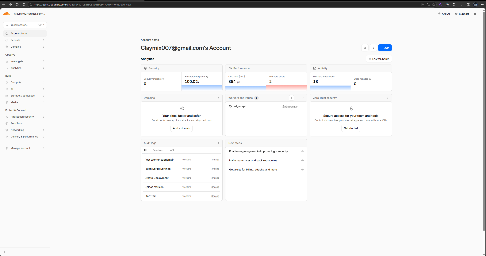
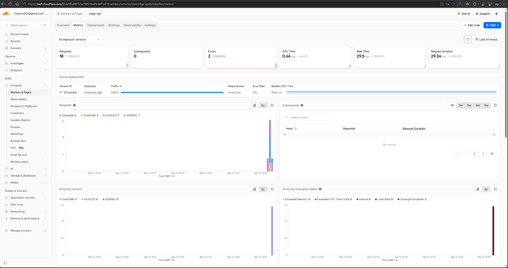

# WORKERS.md — Lab 17: Cloudflare Workers Edge Deployment

> Deliverable for **Lab 17 — Cloudflare Workers Edge Deployment** (DevOps Core,
> Exam Alternative). Source code lives in this directory (`edge-api/`).

---

## 1. Deployment Summary

### Worker URL
`https://edge-api.claymix.workers.dev`

### Main routes

| Method | Path       | Purpose                                                           |
| ------ | ---------- | ----------------------------------------------------------------- |
| GET    | `/`        | App metadata, reads plaintext vars from `wrangler.jsonc`.         |
| GET    | `/health`  | Liveness probe, always `{"status":"ok"}`.                         |
| GET    | `/edge`    | Edge-injected request metadata (`request.cf`): colo, country, ASN, TLS, HTTP protocol. |
| GET    | `/info`    | Confirms vars are loaded and secrets are bound (without leaking values). |
| GET    | `/counter` | KV-backed visit counter, persisted in the `SETTINGS` namespace.   |

### Configuration used

| Setting                 | Value                                  | Source                  |
| ----------------------- | -------------------------------------- | ----------------------- |
| `name`                  | `edge-api`                             | `wrangler.jsonc`        |
| `main`                  | `src/index.ts`                         | `wrangler.jsonc`        |
| `compatibility_date`    | `2026-05-13`                           | `wrangler.jsonc`        |
| `observability.enabled` | `true`                                 | `wrangler.jsonc`        |
| `vars.APP_NAME`         | `edge-api`                             | `wrangler.jsonc` (Task 4.1) |
| `vars.COURSE_NAME`      | `devops-core`                          | `wrangler.jsonc` (Task 4.1) |
| Secret `API_TOKEN`      | encrypted, set via `wrangler secret`   | Cloudflare (Task 4.2)   |
| Secret `ADMIN_EMAIL`    | encrypted, set via `wrangler secret`   | Cloudflare (Task 4.2)   |
| KV binding `SETTINGS`   | `0938d409f5e94b169cacc09d704cda4d`     | Cloudflare KV (Task 4.3) |

---

## 2. Evidence

### 2.1 `/edge` JSON response (Task 3.2)

Captured by hitting the deployed Worker (NOT `wrangler dev` — `request.cf` is
populated only when traffic actually flows through Cloudflare's edge):

```bash
curl.exe https://edge-api.claymix.workers.dev/edge
```

```powershell
PS C:\Users\claym\Desktop\study\Spring25\DevOps\DevOps-Core-Course\edge-api> curl.exe https://edge-api.claymix.workers.dev/edge
{
  "colo": "ARN",
  "country": "FI",
  "city": "Helsinki",
  "region": "Uusimaa",
  "asn": 56594,
  "asOrganization": "CGI GLOBAL LIMITED",
  "httpProtocol": "HTTP/1.1",
  "tlsVersion": "TLSv1.3",
  "timezone": "Europe/Helsinki",
  "clientAcceptEncoding": "gzip, br",
  "observedAt": "2026-05-13T17:25:30.669Z"
}
```

The values are filled in by Cloudflare at the edge, before the Worker runs —
my code only forwards `request.cf?.*` into the response body. The `colo` field
is the 3-letter IATA code of the data center that served the request.

### 2.2 Logs (Task 5.1)

Tail produced by `npx wrangler tail` while hitting `/counter` from a browser:

```powershell
PS C:\Users\claym\Desktop\study\Spring25\DevOps\DevOps-Core-Course\edge-api> npx wrangler tail

 ⛅️ wrangler 4.90.1
───────────────────
Successfully created tail, expires at 2026-05-13T23:14:01Z
Connected to edge-api, waiting for logs...
GET https://edge-api.claymix.workers.dev/counter - Ok @ 13.05.2026, 20:26:32
  (log) request {"method":"GET","path":"/counter","colo":"ARN","country":"FI"}
GET https://edge-api.claymix.workers.dev/counter - Ok @ 13.05.2026, 20:26:37
  (log) request {"method":"GET","path":"/counter","colo":"ARN","country":"FI"}
GET https://edge-api.claymix.workers.dev/counter - Ok @ 13.05.2026, 20:26:38
  (log) request {"method":"GET","path":"/counter","colo":"ARN","country":"FI"}
```

The `(log)` line comes from `console.log("request", ...)` at the top of the
`fetch` handler in `src/index.ts`. Because `observability.enabled = true` is set
in `wrangler.jsonc`, the same log entries also appear under **Workers & Pages →
edge-api → Logs** in the dashboard.

### 2.3 Persistence verification (Task 4.4)

Procedure:

1. `curl .../counter` three times → response shows `visits: 1, 2, 3`.
2. Edit a string in `src/index.ts` (e.g., the greeting on `/`).
3. `npx wrangler deploy` to ship a new version.
4. `curl .../counter` → response shows `visits: 4`. The previous value survived
   because it lives in Workers KV, not in the Worker's memory.

```powershell
PS C:\Users\claym\Desktop\study\Spring25\DevOps\DevOps-Core-Course\edge-api> curl.exe https://edge-api.claymix.workers.dev/
{
  "app": "edge-api",
  "course": "devops-core",
  "version": "1.0.0",
  "message": "Hello from Cloudflare Workers (edge-api).",
  "routes": [
    "/",
    "/health",
    "/edge",
    "/info",
    "/counter"
  ],
  "startedAt": "1970-01-01T00:00:00.000Z",
  "now": "2026-05-13T17:30:35.713Z"
}
PS C:\Users\claym\Desktop\study\Spring25\DevOps\DevOps-Core-Course\edge-api> npx wrangler deploy

 ⛅️ wrangler 4.90.1
───────────────────
Total Upload: 3.23 KiB / gzip: 1.24 KiB
Your Worker has access to the following bindings:
Binding                                                 Resource
env.SETTINGS (0938d409f5e94b169cacc09d704cda4d)         KV Namespace
env.APP_NAME ("edge-api")                               Environment Variable
env.COURSE_NAME ("devops-core")                         Environment Variable

Uploaded edge-api (10.55 sec)
Deployed edge-api triggers (5.58 sec)
  https://edge-api.claymix.workers.dev
Current Version ID: 02aaadbb-efd2-4e5f-958c-3335815136d0
PS C:\Users\claym\Desktop\study\Spring25\DevOps\DevOps-Core-Course\edge-api> curl.exe https://edge-api.claymix.workers.dev/counter
{
  "key": "visits",
  "visits": 6,
  "previous": 5,
  "persistedIn": "Workers KV (binding SETTINGS)"
}
```

What I stored: a single key `visits` (string-serialized integer) inside the
`SETTINGS` KV namespace. The Worker reads the current value, increments it, and
writes it back on every `GET /counter`. KV is eventually consistent globally,
which is acceptable for a counter that does not need strict ordering.

### 2.4 Cloudflare dashboard




I looked at the **Metrics** tab for `edge-api` (last 24 h). The summary tiles
show **18 requests**, **2 errors**, **0.66 ms** average CPU time, 29.5 ms wall
time, and 29.34 ms request duration. The **Active deployment** row for version
`02aaadbb` reports 100% traffic, **0% error rate**, and **0.94 ms** median CPU
time. The account-level overview corroborates this: **P99 CPU time = 854 µs**,
18 invocations, 100% encrypted requests.

The 2 errors are classified as **Uncaught Exception** in the "Errors by
invocation status" panel. They came from a short window during initial setup
when I hit `/counter` before pasting the real KV namespace id into
`wrangler.jsonc` — `env.SETTINGS` was unbound and the KV call threw. Once the
id was in place and the Worker redeployed, the error rate dropped to 0% on
the active deployment (visible in the same panel). The low CPU time is
expected because every handler either returns synchronous JSON or performs a
single KV read/write.

### 2.5 Secrets verification (Task 4.2)

Two secrets are configured on Cloudflare via `wrangler secret put`:

- `API_TOKEN`
- `ADMIN_EMAIL`

The deployed Worker reads them off the `env` object inside the `/info`
handler (`src/index.ts`) and reports presence-only — it never echoes the
actual value:

```powershell
PS C:\Users\claym\Desktop\study\Spring25\DevOps\DevOps-Core-Course\edge-api> curl.exe https://edge-api.claymix.workers.dev/info
{
  "app": "edge-api",
  "course": "devops-core",
  "version": "1.0.0",
  "secrets": {
    "API_TOKEN": "present (5 chars)",
    "ADMIN_EMAIL": "present (20 chars)"
  },
  "note": "Plaintext vars (APP_NAME, COURSE_NAME) live in wrangler.jsonc and are safe to commit. Secrets are injected via `wrangler secret put` and are never echoed."
}
```

Each `wrangler secret put` operation produces a Cloudflare-side deployment
record of type **`Secret Change`** — see entries `cd52ce22` and `24eb3d8b` in
the deployment history below (§2.6). The secret *values* themselves are
stored encrypted on Cloudflare's side and never appear in `wrangler.jsonc`,
in this repo, or in the API response. That's the reason secrets need their
own command (`wrangler secret put`) instead of being declared in
`wrangler.jsonc` like plaintext `vars` are.

### 2.6 Deployment history and rollback (Task 5.3)

```powershell
PS C:\Users\claym\Desktop\study\Spring25\DevOps\DevOps-Core-Course\edge-api> npx wrangler deployments list

 ⛅️ wrangler 4.90.1
───────────────────
Created:     2026-05-13T17:09:26.919Z
Author:      claymix007@gmail.com
Source:      Upload
Message:     Automatic deployment on upload.
Version(s):  (100%) 0dbc62f1-220a-40ac-ad31-661bbc295dc9

Created:     2026-05-13T17:09:29.492Z
Author:      claymix007@gmail.com
Source:      Secret Change
Version(s):  (100%) cd52ce22-87b8-4c36-b6c8-fbf73c29ebfd

Created:     2026-05-13T17:10:22.795Z
Author:      claymix007@gmail.com
Source:      Secret Change
Version(s):  (100%) 24eb3d8b-87e9-4e0c-8c37-22a7a89c6790

Created:     2026-05-13T17:10:50.751Z
Author:      claymix007@gmail.com
Source:      Unknown (deployment)
Version(s):  (100%) a135f82c-762f-4ceb-8577-d3360622dbd0

Created:     2026-05-13T17:18:49.823Z
Author:      claymix007@gmail.com
Source:      Unknown (deployment)
Message:     Rollback
Version(s):  (100%) 24eb3d8b-87e9-4e0c-8c37-22a7a89c6790

Created:     2026-05-13T17:24:59.053Z
Author:      claymix007@gmail.com
Source:      Unknown (deployment)
Version(s):  (100%) 61c65232-53a1-47c9-b12c-a78e4efea209

Created:     2026-05-13T17:30:59.152Z
Author:      claymix007@gmail.com
Source:      Unknown (deployment)
Version(s):  (100%) 02aaadbb-efd2-4e5f-958c-3335815136d0
```

Walking the timeline chronologically:

| #  | Time (UTC)              | Version    | What happened                                                  |
| -- | ----------------------- | ---------- | -------------------------------------------------------------- |
| 1  | 2026-05-13 17:09:26     | `0dbc62f1` | Initial `wrangler deploy` — first version live.                |
| 2  | 2026-05-13 17:09:29     | `cd52ce22` | `wrangler secret put API_TOKEN` — adds the first secret.       |
| 3  | 2026-05-13 17:10:22     | `24eb3d8b` | `wrangler secret put ADMIN_EMAIL` — adds the second secret.    |
| 4  | 2026-05-13 17:10:50     | `a135f82c` | Code redeploy.                                                 |
| 5  | 2026-05-13 17:18:49     | `24eb3d8b` | **`wrangler rollback`** — live traffic reverted to step-3 version. |
| 6  | 2026-05-13 17:24:59     | `61c65232` | Roll-forward via `wrangler deploy`.                            |
| 7  | 2026-05-13 17:30:59     | `02aaadbb` | Current active deployment (matches the `Active deployment` row in the metrics screenshot in §2.4). |

This single command output satisfies all three sub-requirements of Task 5.3 in
one shot: at least 2 versions deployed (7 here), deployment history viewed,
and an actual rollback performed (row 5 — note the `Message: Rollback` and
the duplicated `24eb3d8b` version id, showing the live pointer was switched
back to a previously-deployed version rather than re-uploading new code).

The fact that secret operations show up in the same history as code
deployments is itself useful — it means Cloudflare treats binding changes
(secrets, KV bindings, vars) and code uploads as a single ordered audit log,
which you can roll forward or backward through with one `wrangler rollback`.

---

## 3. Global Distribution & Routing (Task 3.3 + 3.4)

### How Workers distributes execution globally

A deployed Worker is automatically replicated to every Cloudflare data center
(300+ cities at the time of writing). When a request arrives, Cloudflare's
Anycast network terminates TCP/TLS at the geographically closest healthy colo
and runs the Worker there using the V8 isolate runtime. There is no per-region
deployment step, no autoscaling configuration, no load balancer to manage, and
no "warm pool" of containers. Cold-start latency is on the order of a few
milliseconds because isolates share a single host process.

### Why there is no "deploy to 3 regions" step

In a Kubernetes or VM-based PaaS (EKS, GKE, Fly.io, Render…) you choose which
regions your workload runs in, then you size replica counts per region and wire
a global load balancer (Cloudflare itself, Route 53, etc.) in front. Each
region is an explicit decision with explicit cost. Workers inverts this: the
*default and only* deployment target is "the entire edge network". You cannot
deploy a Worker to "only us-east-1" via `wrangler deploy`; the request you
write `console.log` for might be served from Frankfurt, São Paulo or Singapore
depending on who called it. This trades fine-grained placement control for
zero regional configuration.

### `workers.dev` vs Routes vs Custom Domains

| Mechanism      | How traffic gets to the Worker                                              | When to use it                                              |
| -------------- | --------------------------------------------------------------------------- | ----------------------------------------------------------- |
| `workers.dev`  | Cloudflare auto-assigns `https://<name>.<subdomain>.workers.dev`. No DNS work. | Demos, labs, internal APIs, anything where the URL doesn't matter. **Used for this lab.** |
| Routes         | You own a Cloudflare zone (e.g., `example.com`) and attach the Worker to a URL pattern (`api.example.com/*`). Other traffic on that zone still flows to your origin. | You have an existing site on Cloudflare and want the Worker to handle only a subset of requests (e.g., `/api/*`). |
| Custom Domains | You attach a hostname (e.g., `api.example.com`) to the Worker; Cloudflare provisions a cert and makes the Worker the *origin* — no other origin needed. | You want a serverless API on your own domain without running anything on your origin server. |

For this lab the `workers.dev` URL is the required deployment target; the
custom-domain path is optional.

---

## 4. Kubernetes vs Cloudflare Workers (Task 6.3)

| Aspect                  | Kubernetes (Labs 9–16, Minikube + Helm + ArgoCD)                                                                  | Cloudflare Workers (this lab)                                                                            |
| ----------------------- | ----------------------------------------------------------------------------------------------------------------- | -------------------------------------------------------------------------------------------------------- |
| Setup complexity        | High: cluster, kubelet, CNI, Ingress, cert-manager, Helm, ArgoCD; many YAML files and CRDs.                       | Very low: `npm create cloudflare`, one `wrangler.jsonc`, one `wrangler deploy`.                          |
| Deployment speed        | Tens of seconds to minutes (image build, push, rolling update); GitOps adds another sync cycle.                   | A few seconds end-to-end. `wrangler deploy` pushes a new version that is globally live in ~3-10 s.      |
| Global distribution     | Manual: you pick regions/clusters, run a multi-cluster setup, configure GeoDNS or a global LB.                    | Automatic: every Worker runs in every Cloudflare colo (300+ cities) the moment you deploy.               |
| Cost (for small apps)   | Pays for nodes 24/7 even at zero traffic; control plane fees on managed K8s; LB charges per hour.                 | Free tier (100k req/day) covers a lab easily; paid plan is request-based and effectively $0 at idle.    |
| State / persistence     | Anything you want: PVCs, StatefulSets (Lab 15), external DBs, Redis, etc. Full filesystem and long-lived sockets. | Stateless isolates. State must live in a Cloudflare-managed store: KV, R2, D1, Durable Objects, Queues.  |
| Control / flexibility   | Maximum: arbitrary containers, sidecars (logging, service mesh), init containers (Lab 16), DaemonSets, GPUs.      | Constrained: V8 isolate only, no native binaries, no long-running processes, 30 s CPU limit per request. |
| Best use case           | Long-running stateful services, microservices with custom runtimes, anything that needs containers or pods.       | Global HTTP/JSON APIs, request transformations, edge auth, A/B routing, lightweight serverless backends. |

---

## 5. When to Use Each (Task 6.4)

### Scenarios favoring Kubernetes

- A Python ML inference service that must load a 4 GB model into memory and
  serve persistent gRPC connections. Workers' isolate model and 128 MB memory
  ceiling do not fit.
- A stateful Postgres / Kafka / Elasticsearch deployment using StatefulSets and
  PVCs (the pattern from Lab 15). Workers has no equivalent of a block volume.
- A multi-container pod with a sidecar (e.g., Envoy proxy, log shipper, init
  container that warms a cache before the main container starts — Lab 16).
- Strict regional residency rules ("data must stay in EU only"). Workers runs
  everywhere by default; on Kubernetes you can pin nodes to a region.

### Scenarios favoring Workers

- A small JSON API that does request validation, calls a downstream service,
  and returns. Latency for users in 5 continents matters. Lab 17 fits exactly
  here.
- An edge auth/redirect layer that must respond in under 50 ms globally.
- A webhook receiver that should not have a 24/7 idle bill.
- A static-site companion API (form submissions, view counters, comments) that
  needs persistence (KV) but not a database server.

### My recommendation

Use **Workers** when the workload is a stateless HTTP request → JSON response
pattern, fits inside the runtime constraints (V8, ≤128 MB, ≤30 s CPU), and
benefits from global latency. Use **Kubernetes** when you need full control of
the runtime, long-lived processes, sidecars, or you already operate a fleet of
containerised services. Most production systems end up combining both:
Workers at the edge for routing/auth/caching, Kubernetes behind it for
heavyweight business logic.

---

## 6. Reflection (Task 6.5)

### What felt easier than Kubernetes

- **No cluster to provision.** With Kubernetes (Lab 9 onwards) every lab
  started with `minikube start`, namespace setup, image build, image push, and
  a manifest apply. Here I literally typed `wrangler deploy` and the API was
  globally reachable a few seconds later.
- **No image to build.** Workers takes my TypeScript directly. There is no
  Dockerfile, no registry, no `imagePullPolicy`, no `ImagePullBackOff` to
  debug.
- **No load balancer or Ingress.** A `workers.dev` URL with a valid TLS
  certificate appears automatically. Compare with Lab 11/12 where I configured
  Ingress + TLS secrets manually.
- **Built-in observability.** Setting `observability.enabled = true` in one
  JSON property gave me searchable logs in the dashboard, equivalent to wiring
  Loki/Promtail (Lab 7) for a small K8s service.

### What felt more constrained

- **Stateless by default.** I can't write to a local file or hold an in-memory
  cache that lives between requests (isolates can be evicted at any time).
  Every piece of state needs a binding — KV here, but for richer needs you'd
  reach for D1, R2, or Durable Objects.
- **One language at a time.** A K8s pod can run anything. A Worker runs
  TypeScript/JavaScript (or a small set of supported languages via WASM /
  Python beta).
- **CPU and memory limits are firm.** No `resources.limits` to bump like in
  K8s — you fit inside the platform's limits or you don't deploy.
- **Less observability primitive control.** I get logs and basic metrics out
  of the box, but I can't `kubectl exec` into a pod, attach a debugger, or run
  a sidecar like prom-exporter the way I did in Lab 16.

### What changed because Workers is not a Docker host

The whole shape of "deployment" changed. In Labs 2-16 the unit of deployment
was a Docker image: build it, push it, reference it from a manifest, roll it
out. The Dockerfile from Lab 2 has no role here — Cloudflare doesn't run
containers, it runs V8 isolates of my source code. As a consequence:

- There is no base image to harden, no `USER 1001`, no multi-stage build.
- There is no `kubectl rollout undo`; the equivalent is `wrangler rollback`,
  which switches the live version pointer at the edge in seconds (Task 5.3).
- "Configuration" stops meaning ConfigMaps and Secrets objects, and starts
  meaning entries in `wrangler.jsonc` (vars), `wrangler secret put` (secrets),
  and KV namespaces (state) — three different bindings, all surfaced to my
  code on a single typed `env` object.
- Scaling is no longer my problem at all. There is no `replicas:` field, no
  HPA, no node-count tuning. The trade-off is that I gave up the ability to
  run any workload that doesn't fit the isolate model.
