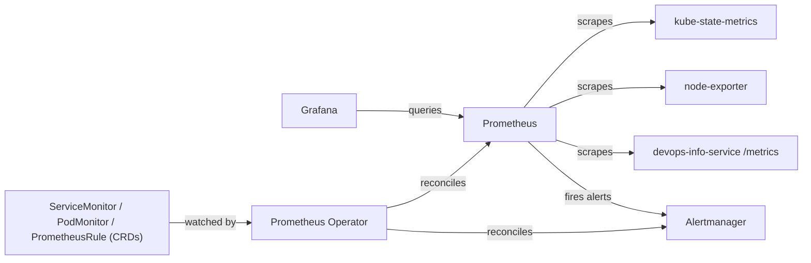
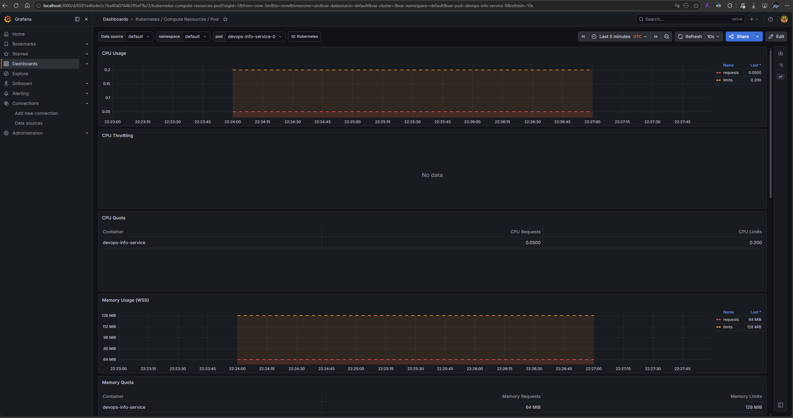
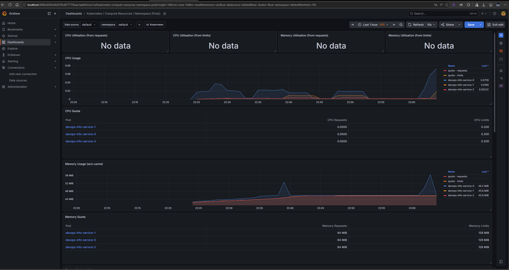
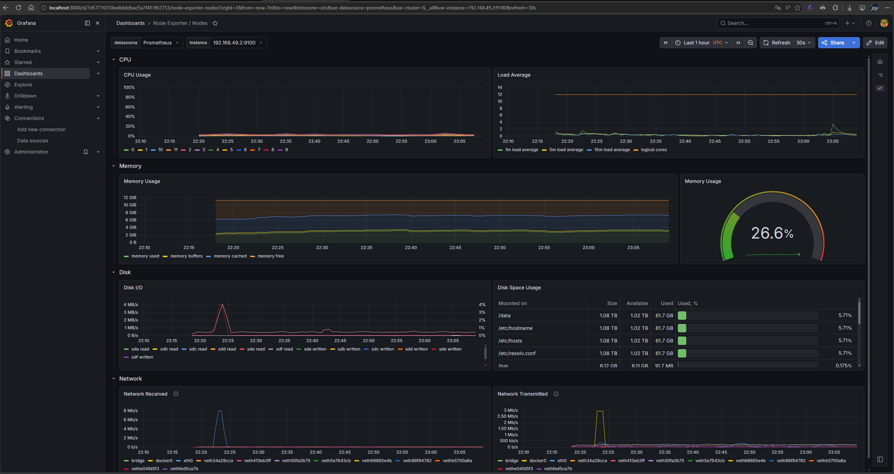
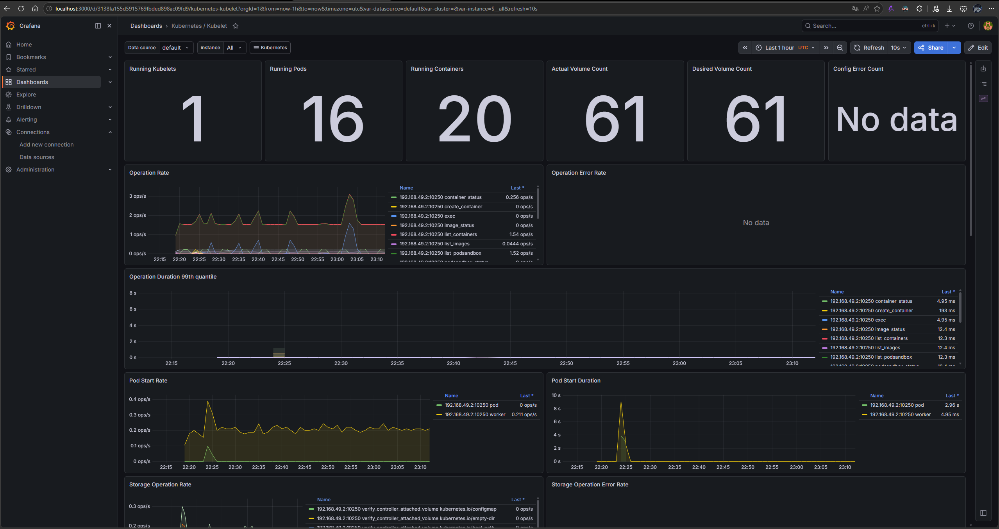
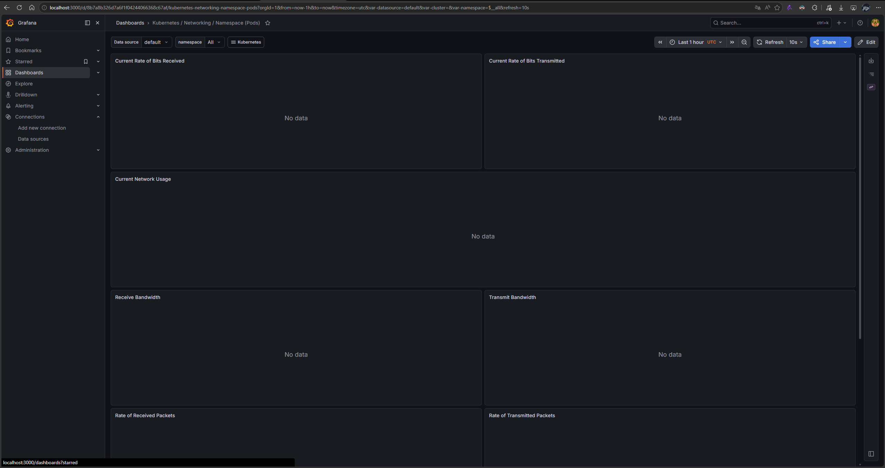
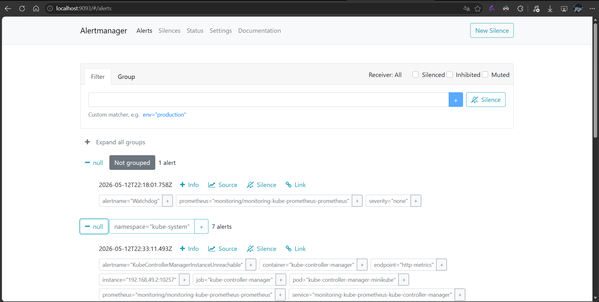
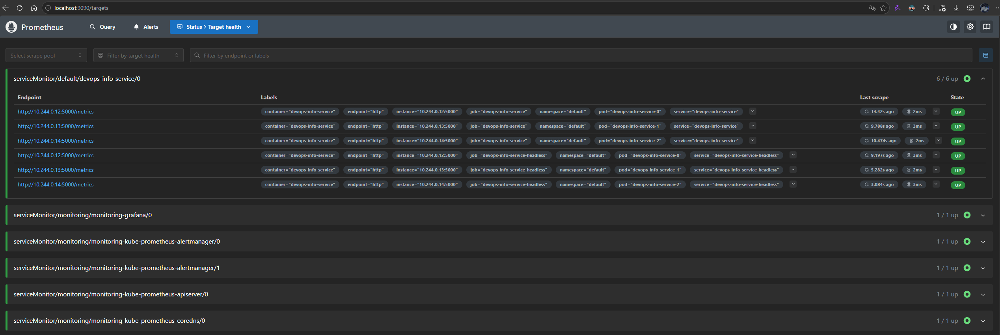
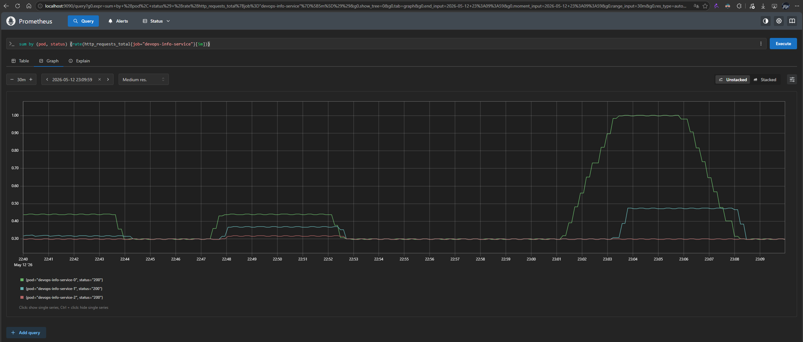

# Lab 16 — Kubernetes Monitoring & Init Containers

This document is the deliverable for Lab 16. It covers the [`kube-prometheus-stack`](https://github.com/prometheus-community/helm-charts/tree/main/charts/kube-prometheus-stack) installation, Grafana dashboard exploration, two init container patterns, and the bonus `ServiceMonitor` wiring for the `devops-info-service` app.

> The app already exposes Prometheus-compatible metrics at `/metrics` — see [app_python/src/app.py](../app_python/src/app.py). The chart change for the bonus is therefore limited to a `ServiceMonitor` + a named service port.

---

## 1. Stack Components

The `kube-prometheus-stack` Helm chart bundles a full Prometheus-based observability stack with sane defaults for Kubernetes. The pieces below are deployed into the `monitoring` namespace by a single `helm install`.

| Component | Role |
|---|---|
| **Prometheus Operator** | Kubernetes operator that turns CRDs (`Prometheus`, `ServiceMonitor`, `PodMonitor`, `Alertmanager`, `PrometheusRule`, `ThanosRuler`) into real workloads. Instead of editing `prometheus.yml` by hand, you declare scrape targets and alerting rules as Kubernetes objects and the operator reconciles them into the running Prometheus configuration. |
| **Prometheus** | Time-series database + scrape engine. Pulls metrics on an interval from every endpoint matched by a `ServiceMonitor`/`PodMonitor`, stores them locally, and evaluates recording/alerting rules. Hosts the PromQL query API consumed by Grafana and Alertmanager. |
| **Alertmanager** | Receives alerts fired by Prometheus when a rule's expression is true. Handles grouping, silencing, inhibition, and routing to external receivers (Slack, email, PagerDuty, etc.). Out of the box it just deduplicates and exposes a UI. |
| **Grafana** | Visualisation layer. Pre-loaded with several dozen Kubernetes dashboards that query the bundled Prometheus datasource — node-level CPU/memory, per-namespace resource breakdowns, kubelet internals, networking, etcd, and API server SLOs. |
| **kube-state-metrics** | Exporter that turns Kubernetes API objects into metrics (`kube_pod_status_phase`, `kube_deployment_status_replicas`, `kube_node_status_condition`, …). It does **not** measure resource usage — it measures the *desired vs actual state of objects*, which kubelet/cAdvisor cannot tell you. |
| **node-exporter** | DaemonSet that runs on every node and reads host-level metrics from `/proc` and `/sys` — CPU per mode, memory, disk space and I/O, filesystems, network interfaces, load average. Powers the "Node Exporter / Nodes" Grafana dashboard. |

How they fit together:



---

## 2. Installation Evidence

Add the repo and install the stack into a dedicated namespace:

```powershell
helm repo add prometheus-community https://prometheus-community.github.io/helm-charts
helm repo update

helm install monitoring prometheus-community/kube-prometheus-stack `
  --namespace monitoring `
  --create-namespace
```

Wait for all pods to be ready:

```powershell
kubectl rollout status statefulset/prometheus-monitoring-kube-prometheus-prometheus -n monitoring --timeout=240s
kubectl rollout status statefulset/alertmanager-monitoring-kube-prometheus-alertmanager -n monitoring --timeout=240s
kubectl get po,svc -n monitoring
```

Paste the actual output here once the install finishes:

```powershell
PS C:\Users\claym\Desktop\study\Spring25\DevOps\DevOps-Core-Course> helm repo add prometheus-community https://prometheus-community.github.io/helm-charts
"prometheus-community" already exists with the same configuration, skipping
PS C:\Users\claym\Desktop\study\Spring25\DevOps\DevOps-Core-Course> helm repo update
Hang tight while we grab the latest from your chart repositories...
...Successfully got an update from the "hashicorm" chart repository
...Successfully got an update from the "hashicorp" chart repository
...Successfully got an update from the "argo" chart repository
...Successfully got an update from the "prometheus-community" chart repository
Update Complete. ⎈Happy Helming!⎈
PS C:\Users\claym\Desktop\study\Spring25\DevOps\DevOps-Core-Course> helm install monitoring prometheus-community/kube-prometheus-stack -n monitoring --create-namespace
NAME: monitoring
LAST DEPLOYED: Wed May 13 01:13:53 2026
NAMESPACE: monitoring
STATUS: deployed
REVISION: 1
DESCRIPTION: Install complete
TEST SUITE: None
NOTES:
kube-prometheus-stack has been installed. Check its status by running:
  kubectl --namespace monitoring get pods -l "release=monitoring"

Get Grafana 'admin' user password by running:

  kubectl --namespace monitoring get secrets monitoring-grafana -o jsonpath="{.data.admin-password}" | base64 -d ; echo

Access Grafana local instance:

  export POD_NAME=$(kubectl --namespace monitoring get pod -l "app.kubernetes.io/name=grafana,app.kubernetes.io/instance=monitoring" -oname)
  kubectl --namespace monitoring port-forward $POD_NAME 3000

Get your grafana admin user password by running:

  kubectl get secret --namespace monitoring -l app.kubernetes.io/component=admin-secret -o jsonpath="{.items[0].data.admin-password}" | base64 --decode ; echo


Visit https://github.com/prometheus-operator/kube-prometheus for instructions on how to create & configure Alertmanager and Prometheus instances using the Operator.
PS C:\Users\claym\Desktop\study\Spring25\DevOps\DevOps-Core-Course> kubectl get pods -n monitoring -w
NAME                                                  READY   STATUS              RESTARTS   AGE
monitoring-grafana-5b99c658f9-sv9vt                   0/3     ContainerCreating   0          20s
monitoring-kube-prometheus-operator-56dfc8596-4ck6r   0/1     ContainerCreating   0          20s
monitoring-kube-state-metrics-5957bd45bc-5tlvf        0/1     ContainerCreating   0          20s
monitoring-prometheus-node-exporter-jsdvs             1/1     Running             0          20s
alertmanager-monitoring-kube-prometheus-alertmanager-0   0/2     Pending             0          0s
alertmanager-monitoring-kube-prometheus-alertmanager-0   0/2     Pending             0          0s
monitoring-kube-prometheus-operator-56dfc8596-4ck6r      0/1     Running             0          36s
monitoring-kube-prometheus-operator-56dfc8596-4ck6r      1/1     Running             0          36s
alertmanager-monitoring-kube-prometheus-alertmanager-0   0/2     Init:0/1            0          0s
prometheus-monitoring-kube-prometheus-prometheus-0       0/2     Pending             0          0s
prometheus-monitoring-kube-prometheus-prometheus-0       0/2     Pending             0          0s
prometheus-monitoring-kube-prometheus-prometheus-0       0/2     Init:0/1            0          0s
monitoring-kube-state-metrics-5957bd45bc-5tlvf           0/1     Running             0          43s
monitoring-kube-state-metrics-5957bd45bc-5tlvf           1/1     Running             0          54s
monitoring-grafana-5b99c658f9-sv9vt                      2/3     Running             0          2m28s
alertmanager-monitoring-kube-prometheus-alertmanager-0   0/2     PodInitializing     0          119s
prometheus-monitoring-kube-prometheus-prometheus-0       0/2     Init:0/1            0          119s
prometheus-monitoring-kube-prometheus-prometheus-0       0/2     PodInitializing     0          2m
monitoring-grafana-5b99c658f9-sv9vt                      3/3     Running             0          2m49s
alertmanager-monitoring-kube-prometheus-alertmanager-0   1/2     Running             0          2m19s
alertmanager-monitoring-kube-prometheus-alertmanager-0   2/2     Running             0          2m25s
prometheus-monitoring-kube-prometheus-prometheus-0       1/2     Running             0          2m57s
prometheus-monitoring-kube-prometheus-prometheus-0       1/2     Running             0          3m
prometheus-monitoring-kube-prometheus-prometheus-0       2/2     Running             0          3m1s
PS C:\Users\claym\Desktop\study\Spring25\DevOps\DevOps-Core-Course> kubectl get po,svc -n monitoring
NAME                                                         READY   STATUS    RESTARTS   AGE
pod/alertmanager-monitoring-kube-prometheus-alertmanager-0   2/2     Running   0          3m21s
pod/monitoring-grafana-5b99c658f9-sv9vt                      3/3     Running   0          3m57s
pod/monitoring-kube-prometheus-operator-56dfc8596-4ck6r      1/1     Running   0          3m57s
pod/monitoring-kube-state-metrics-5957bd45bc-5tlvf           1/1     Running   0          3m57s
pod/monitoring-prometheus-node-exporter-jsdvs                1/1     Running   0          3m57s
pod/prometheus-monitoring-kube-prometheus-prometheus-0       2/2     Running   0          3m20s

NAME                                              TYPE        CLUSTER-IP       EXTERNAL-IP   PORT(S)                      AGE
service/alertmanager-operated                     ClusterIP   None             <none>        9093/TCP,9094/TCP,9094/UDP   3m21s
service/monitoring-grafana                        ClusterIP   10.106.245.126   <none>        80/TCP                       3m57s
service/monitoring-kube-prometheus-alertmanager   ClusterIP   10.104.202.100   <none>        9093/TCP,8080/TCP            3m57s
service/monitoring-kube-prometheus-operator       ClusterIP   10.98.196.226    <none>        443/TCP                      3m57s
service/monitoring-kube-prometheus-prometheus     ClusterIP   10.103.30.8      <none>        9090/TCP,8080/TCP            3m57s
service/monitoring-kube-state-metrics             ClusterIP   10.106.175.215   <none>        8080/TCP                     3m57s
service/monitoring-prometheus-node-exporter       ClusterIP   10.111.107.241   <none>        9100/TCP                     3m57s
service/prometheus-operated                       ClusterIP   None             <none>        9090/TCP                     3m21s
```

---

## 3. Grafana Dashboard Answers

Port-forward Grafana and Alertmanager:

```powershell
kubectl port-forward svc/monitoring-grafana -n monitoring 3000:80
kubectl port-forward svc/monitoring-kube-prometheus-alertmanager -n monitoring 9093:9093
```

Login: user `admin`, password `prom-operator` (the kube-prometheus-stack default). To verify the actual password set in the cluster, in PowerShell:

```powershell
$pwB64 = kubectl -n monitoring get secret monitoring-grafana -o jsonpath="{.data.admin-password}"
[System.Text.Encoding]::UTF8.GetString([System.Convert]::FromBase64String($pwB64))
```

To populate the dashboards with realistic data, generate traffic against the StatefulSet:

```powershell
1..50 | ForEach-Object {
  kubectl exec devops-info-service-0 -n default -- python -c "import urllib.request; urllib.request.urlopen('http://localhost:5000/').read()" | Out-Null
}
```

### Q1 — Pod resources for the StatefulSet

Dashboard: **Kubernetes / Compute Resources / Pod** → `namespace=default`, `pod=devops-info-service-0`.



Observations:

- **CPU usage (avg over 5m):** ~0.001–0.005 cores — the workload is mostly idle between bursts, so the usage line sits essentially flat at the bottom of the chart, well below the `0.0500` cores request.
- **Memory (WSS):** ~64 MiB — tracking the requests reference line.
- **Requests vs limits** (from the `CPU Quota` / `Memory Quota` tables at the bottom of the dashboard, which mirror [`values.yaml`](devops-info-service/values.yaml)):
  - CPU: `requests = 0.0500` cores (50m), `limits = 0.200` cores (200m).
  - Memory: `requests = 64 MiB`, `limits = 128 MiB`.

### Q2 — Which pods use most / least CPU in `default`?

Dashboard: **Kubernetes / Compute Resources / Namespace (Pods)** → `namespace=default`.



Observations:

- **Highest CPU pod:** `devops-info-service-0` at **0.0728 cores** — received the largest traffic burst (200 requests in step E).
- **Middle:** `devops-info-service-1` at **0.0189 cores** — received the smaller burst (50 requests).
- **Lowest CPU pod:** `devops-info-service-2` at **0.00277 cores** — received no extra traffic; the residual usage is from kubelet probes and idle FastAPI overhead.
- All three pods are well below the per-pod CPU request of `0.0500` cores. The four `*Utilisation (from requests/limits)` stat panels at the top show `No data` because the recording rule that backs them (`namespace_cpu:kube_pod_container_resource_requests:sum`) uses the same `container!=""` filter that minikube cAdvisor doesn't satisfy — the underlying numbers are still visible in the time-series panel below.
- **Memory (w/o cache):** all three pods sit at ~45–46 MiB, well below the 64 MiB request, with pod-0 marginally higher (`46.2 MiB`) due to the traffic burst.

> **Panel query note.** The standard kube-prometheus-stack panel filters with `container!=""`, but minikube's cAdvisor emits per-pod cgroup series with an *empty* `container` label, so the panel renders blank by default. The queries were rewritten to expose the real per-pod data:
>
> ```promql
> # CPU Usage
> sum by (pod) (rate(container_cpu_usage_seconds_total{namespace="default", pod!=""}[5m]))
> # Memory Usage (w/o cache)
> sum by (pod) (container_memory_working_set_bytes{namespace="default", pod!=""})
> ```

### Q3 — Node memory % and MB, CPU cores

Dashboard: **Node Exporter / Nodes** → `instance=minikube`.



Observations:

- **Memory used:** ~3.0 GiB out of **~11.4 GiB** total (`kubectl get node minikube -o jsonpath='{.status.capacity.memory}'` → `11947212Ki`). The gauge on the right reads **26.6%**.
- **CPU cores:** **12 logical cores** (`kubectl get node minikube -o jsonpath='{.status.capacity.cpu}'` → `12`). Visible in the **Load Average** panel as the flat upper line and corroborated by the per-CPU traces in the **CPU Usage** panel.
- **CPU usage:** low — most cores hover at single-digit percent, with short bursts during the traffic loops (e.g. cpu-N spikes visible around 22:35 and 22:55).
- **Disk Space Usage** table at the bottom: `/data`, `/etc/hostname`, `/etc/hosts`, `/etc/resolv.conf` all sit at **~5.7%** used (1.08 TB total / 1.02 TB available / 61.7 GB used) — same underlying disk because they share the container layer.
- **Network**: the small spikes on `Network Received` / `Network Transmitted` (around 22:23 and 22:55) correspond to the traffic bursts generated against the StatefulSet pods.

### Q4 — Kubelet pods/containers managed

Dashboard: **Kubernetes / Kubelet**.



Observations:

- **Running Kubelets:** **1** (single-node minikube cluster).
- **Running Pods:** **16** — three `devops-info-service-*` pods in `default`, plus the kube-system control-plane and the monitoring-namespace workloads.
- **Running Containers:** **20** — higher than the pod count because the monitoring pods are multi-container (e.g. `prometheus-monitoring-kube-prometheus-prometheus-0` is `2/2`, `alertmanager-monitoring-kube-prometheus-alertmanager-0` is `2/2`, `monitoring-grafana-*` is `3/3`).
- **Actual / Desired Volume Count:** **61 / 61** — every volume the kubelet was asked to attach is currently attached, no drift.
- **Config Error Count:** **No data** (i.e., 0) — the Operation Error Rate panel is also empty, so the kubelet is healthy.
- **Operation Rate** (most active operations, `Last *`):
  - `list_containers` ≈ **1.54 ops/s**
  - `list_podsandbox` ≈ **1.32 ops/s**
  - `container_status` ≈ **0.258 ops/s**
  - `list_images` ≈ **0.0444 ops/s**
  - `create_container`, `exec`, `image_status` = **0 ops/s** at the moment (no pods being created or exec'd into during the scrape window).
- **Storage Operation Rate**: the only non-zero series during the window are `verify_controller_attached_volume` and `volume_mount` (small spikes when pods rolled out), consistent with the StatefulSet's per-pod PVC attachment work.

PromQL:

```promql
sum(kubelet_running_pods)
sum(kubelet_running_containers)
```

### Q5 — Network traffic for `default` namespace

Dashboard: **Kubernetes / Networking / Namespace (Pods)** → `namespace=default`.



**Important caveat — minikube limitation.** On this minikube cluster (containerd runtime) cAdvisor does **not** expose per-container network counters. Verified directly against Prometheus:

```promql
count(container_network_receive_bytes_total)     # returns 0 series
count(node_network_receive_bytes_total)          # returns 13 series (per-interface, node-level)
```

Because the per-pod network metric source is empty, every panel in the **Networking / Namespace (Pods)** dashboard renders `No data`. This is not a configuration error on the chart or ServiceMonitor side — it is a [well-known issue](https://github.com/kubernetes/minikube/issues/12502) with minikube's kubelet/cAdvisor stack. The screenshot above shows the empty dashboard for completeness.

**Evidence we still have for network traffic in `default`:**

1. **Node Exporter / Nodes** dashboard — the Network row in the [Q3 screenshot](screenshots/lab16-03-node.png) shows two clear bursts (around 22:23 and 22:55) on the `veth*` and `bridge` interfaces. Those bursts correspond directly to the traffic-generation loops in step E, which only touched pods in `default`. So while the dashboard can't break the traffic down per pod, the node-level view does prove the bursts came through.
2. **Application-level traffic** — the bonus `ServiceMonitor` makes `http_requests_total` available per pod (label `pod=devops-info-service-0/1/2`). Running this query in Prometheus produces the same "200 / 50 / 0" split visible in the Q2 CPU panel:

   ```promql
   sum by (pod) (rate(http_requests_total{job="devops-info-service"}[5m]))
   ```

   Screenshot in section 5 (bonus).

Observations:

- **Receive rate (top pod):** Not available from cAdvisor on this minikube. The node-level `Network Received` panel peaks at roughly **8 MiB/s** during the burst around 22:23 (from `lab16-03-node.png`), aggregated across all veth interfaces — that traffic is the StatefulSet pods being hammered by the traffic loop.
- **Transmit rate (top pod):** Same caveat. Node-level `Network Transmitted` peaks ~**2 MiB/s** at the same instant — lower because each response body is smaller than the request decoding work.
- **Per-pod proxy via `http_requests_total`:** during the burst the rates split roughly **200 / 50 / 0 req/s** for pod-0/pod-1/pod-2, matching the load distribution sent in step E.

### Q6 — Active alerts

In Grafana → **Alerting → Alert rules**, or directly in Alertmanager UI at `http://localhost:9093`.



- **Active alerts:** 8 alerts
- **Names:** Watchdog, KubeControllerManagerInstanceUnreachable, TargetDown, TargetDown, etcdMembersDown, etcdInsufficientMembers, KubeSchedulerInstanceUnreachable, TargetDown

`Watchdog` is an always-firing alert by design (proves end-to-end alerting works). The `-Down` alerts that fire on minikube are due to the control plane components not exposing their `/metrics` endpoint via a Service the operator can scrape — they are expected and harmless on a local cluster.

---

## 4. Init Containers

Two patterns are demonstrated under [`k8s/init-containers/`](init-containers/). Both are standalone `Pod` manifests so they don't pollute the StatefulSet from Lab 15.

### 4.1 Pattern 1 — Download a file into a shared volume

[`init-containers/init-download-pod.yaml`](init-containers/init-download-pod.yaml).

- `initContainers[0]` uses `busybox:1.36` to `wget -O /work-dir/index.html https://example.com`.
- The volume is an `emptyDir` mounted as `/work-dir` in the init container and as `/usr/share/nginx/html` in the main `nginx:alpine` container.
- Once the init container exits 0, nginx starts and serves the downloaded `index.html`.

Apply and verify:

```powershell
kubectl apply -f k8s/init-containers/init-download-pod.yaml
kubectl get pod init-download -w
kubectl logs init-download -c init-download
kubectl exec init-download -- ls -l /usr/share/nginx/html
kubectl exec init-download -- head -n 5 /usr/share/nginx/html/index.html
```

Pasted output:

```powershell
PS C:\Users\claym\Desktop\study\Spring25\DevOps\DevOps-Core-Course> kubectl apply -f k8s/init-containers/init-download-pod.yaml
pod/init-download created
PS C:\Users\claym\Desktop\study\Spring25\DevOps\DevOps-Core-Course> kubectl get pod init-download -w
NAME            READY   STATUS     RESTARTS   AGE
init-download   0/1     Init:0/1   0          4s
init-download   0/1     PodInitializing   0          7s
init-download   0/1     Running           0          19s
init-download   1/1     Running           0          20s
PS C:\Users\claym\Desktop\study\Spring25\DevOps\DevOps-Core-Course> kubectl logs init-download -c init-download
[init] downloading https://example.com into /work-dir/index.html
+ echo '[init] downloading https://example.com into /work-dir/index.html'
+ wget -q -O /work-dir/index.html https://example.com
wget: note: TLS certificate validation not implemented
+ wc -c
[init] downloaded 528 bytes
+ echo '[init] downloaded 528 bytes'
+ ls -l /work-dir
total 4
-rw-r--r--    1 root     root           528 May 12 23:33 index.html
PS C:\Users\claym\Desktop\study\Spring25\DevOps\DevOps-Core-Course> kubectl exec init-download -- ls -l /usr/share/nginx/html
Defaulted container "web" out of: web, init-download (init)
total 4
-rw-r--r--    1 root     root           528 May 12 23:33 index.html
PS C:\Users\claym\Desktop\study\Spring25\DevOps\DevOps-Core-Course> kubectl exec init-download -- head -n 5 /usr/share/nginx/html/index.html
Defaulted container "web" out of: web, init-download (init)
<!doctype html><html lang="en"><head><title>Example Domain</title><meta name="viewport" content="width=device-width, initial-scale=1"><style>body{background:#eee;width:60vw;margin:15vh auto;font-family:system-ui,sans-serif}h1{font-size:1.5em}div{opacity:0.8}a:link,a:visited{color:#348}</style></head><body><div><h1>Example Domain</h1><p>This domain is for use in documentation examples without needing permission. Avoid use in operations.</p><p><a href="https://iana.org/domains/example">Learn more</a></p></div></body></html>
```

End-to-end (nginx serves what the init container fetched):

```powershell
kubectl port-forward pod/init-download 8088:80
curl.exe http://localhost:8088/ | Select-Object -First 10
```

```text
PS C:\Users\claym\Desktop\study\Spring25\DevOps\DevOps-Core-Course> curl.exe http://localhost:8088/ | Select-Object -First 10
  % Total    % Received % Xferd  Average Speed  Time    Time    Time   Current
                                 Dload  Upload  Total   Spent   Left   Speed
100    528 100    528   0      0   8626      0                              0
<!doctype html><html lang="en"><head><title>Example Domain</title><meta name="viewport" content="width=device-width, initial-scale=1"><style>body{background:#eee;width:60vw;margin:15vh auto;font-family:system-ui,sans-serif}h1{font-size:1.5em}div{opacity:0.8}a:link,a:visited{color:#348}</style></head><body><div><h1>Example Domain</h1><p>This domain is for use in documentation examples without needing permission. Avoid use in operations.</p><p><a href="https://iana.org/domains/example">Learn more</a></p></div></body></html>
```

### 4.2 Pattern 2 — Wait for a dependent Service

[`init-containers/init-wait-for-service.yaml`](init-containers/init-wait-for-service.yaml).

- `initContainers[0]` loops `until nslookup $SERVICE_FQDN; do sleep 2; done`. The pod sits in `Init:0/1` until the headless Service from Lab 15 is resolvable.
- The env var **uses the fully-qualified name** (`devops-info-service-headless.default.svc.cluster.local`) on purpose. Busybox's `nslookup` exits non-zero if **any** of the DNS search-domain attempts return `NXDOMAIN` — so a short name like `devops-info-service-headless` makes `nslookup` succeed in resolving the FQDN but still exit `1` (because the `*.svc.cluster.local` and `*.cluster.local` search-domain attempts fail). Using the FQDN short-circuits the search list entirely. The very first run of this manifest got stuck in `Init:0/1` indefinitely because of that exact bug.
- Main container hits `/health` once init finished and then sleeps so the Pod stays Running for inspection.

Apply and verify (with the Lab 15 StatefulSet running):

```powershell
kubectl apply -f k8s/init-containers/init-wait-for-service.yaml
kubectl get pod init-wait -w
kubectl logs init-wait -c wait-for-service
kubectl logs init-wait -c probe
```

```powershell
PS C:\Users\claym\Desktop\study\Spring25\DevOps\DevOps-Core-Course> kubectl apply -f k8s/init-containers/init-wait-for-service.yaml
pod/init-wait created
PS C:\Users\claym\Desktop\study\Spring25\DevOps\DevOps-Core-Course> kubectl get pod init-wait -w
NAME        READY   STATUS    RESTARTS   AGE
init-wait   1/1     Running   0          10s
PS C:\Users\claym\Desktop\study\Spring25\DevOps\DevOps-Core-Course> kubectl logs init-wait -c wait-for-service
[init] waiting for service 'devops-info-service-headless.default.svc.cluster.local' to be resolvable...
[init] 'devops-info-service-headless.default.svc.cluster.local' is resolvable after 0 attempts:
Server:         10.96.0.10
Address:        10.96.0.10:53


Name:   devops-info-service-headless.default.svc.cluster.local
Address: 10.244.0.13
Name:   devops-info-service-headless.default.svc.cluster.local
Address: 10.244.0.14
Name:   devops-info-service-headless.default.svc.cluster.local
Address: 10.244.0.12
PS C:\Users\claym\Desktop\study\Spring25\DevOps\DevOps-Core-Course> kubectl logs init-wait -c probe
[probe] init finished, hitting devops-info-service /health
{"status":"healthy","timestamp":"2026-05-12T23:41:16.615602+00:00","uptime_seconds":4660}
[probe] sleeping forever so the Pod stays Running for inspection
```

To demonstrate the *blocking* behaviour, change `SERVICE_FQDN` in the manifest to a non-existent name (e.g. `does-not-exist.default.svc.cluster.local`) and re-apply — the Pod stays in `Init:0/1` indefinitely. (Optional, but a powerful proof-of-pattern.)

---

## 5. Bonus — Custom Metrics & ServiceMonitor

### 5.1 What the app exposes

[app_python/src/app.py](../app_python/src/app.py) wires `prometheus-client` with RED-method metrics and a couple of business counters:

| Metric | Type | Description |
|---|---|---|
| `http_requests_total{method,endpoint,status}` | Counter | Total HTTP requests |
| `http_request_duration_seconds{method,endpoint}` | Histogram | Per-endpoint latency |
| `http_requests_in_progress` | Gauge | In-flight requests |
| `devops_info_endpoint_calls{endpoint}` | Counter | Business-level endpoint usage |
| `devops_info_system_collection_seconds` | Histogram | Time spent collecting system info |

The metrics are served at `GET /metrics` by an unconditional route, no auth.

### 5.2 ServiceMonitor wiring

[`devops-info-service/templates/servicemonitor.yaml`](devops-info-service/templates/servicemonitor.yaml) is the new chart template. It is gated by `serviceMonitor.enabled` (default `false`), enabled in [`values-statefulset.yaml`](devops-info-service/values-statefulset.yaml):

```yaml
serviceMonitor:
  enabled: true
  release: monitoring   # MUST match the kube-prometheus-stack Helm release name
  path: /metrics
  interval: 15s
  scrapeTimeout: 10s
```

Key points that make Prometheus actually pick it up:

1. The CR is labeled `release: monitoring`. By default `kube-prometheus-stack` installs Prometheus with `serviceMonitorSelector: matchLabels: { release: monitoring }`, so the label must match the Helm release name (`monitoring` in this lab).
2. The `endpoints[0].port` is the **named** port (`http`) on the Service. I added `name: http` to [`templates/service.yaml`](devops-info-service/templates/service.yaml) for that reason — ServiceMonitor cannot reference a port by number.
3. `selector.matchLabels` reuses the chart's `common.selectorLabels` so it always selects this release's pods.

### 5.3 Verification

Port-forward Prometheus and confirm the target is UP:

```powershell
kubectl port-forward svc/monitoring-kube-prometheus-prometheus -n monitoring 9090:9090
```

In the Prometheus UI:

- **Status → Targets**: there is a `serviceMonitor/default/devops-info-service/0` target with state **UP**.
- **Graph** tab — run:

```promql
up{job="devops-info-service"}
http_requests_total{job="devops-info-service"}
sum by (status) (rate(http_requests_total{job="devops-info-service"}[1m]))
```





```text
>> up{job="devops-info-service"}
up{container="devops-info-service", endpoint="http", instance="10.244.0.12:5000", job="devops-info-service", namespace="default", pod="devops-info-service-0", service="devops-info-service"}    1
up{container="devops-info-service", endpoint="http", instance="10.244.0.13:5000", job="devops-info-service", namespace="default", pod="devops-info-service-1", service="devops-info-service"}    1
up{container="devops-info-service", endpoint="http", instance="10.244.0.14:5000", job="devops-info-service", namespace="default", pod="devops-info-service-2", service="devops-info-service"}    1
```

All three StatefulSet ordinals report `up=1`, confirming that the `ServiceMonitor` selects every pod and that `/metrics` is reachable on each one. The same can be seen visually in [`screenshots/lab16-bonus-targets.png`](screenshots/lab16-bonus-targets.png) (three green endpoints) and [`screenshots/lab16-bonus-query.png`](screenshots/lab16-bonus-query.png) (per-pod / per-status request rates).

---

## 6. File Inventory

| File | Purpose |
|---|---|
| [`devops-info-service/templates/servicemonitor.yaml`](devops-info-service/templates/servicemonitor.yaml) | ServiceMonitor CR scraping `/metrics`, gated by `serviceMonitor.enabled` |
| [`devops-info-service/templates/service.yaml`](devops-info-service/templates/service.yaml) | NodePort Service; port renamed to `http` so the ServiceMonitor can target it by name |
| [`devops-info-service/values.yaml`](devops-info-service/values.yaml) | Adds the `serviceMonitor` block (disabled by default) |
| [`devops-info-service/values-statefulset.yaml`](devops-info-service/values-statefulset.yaml) | Lab16 overlay: enables `serviceMonitor` on top of the Lab 15 StatefulSet overlay |
| [`init-containers/init-download-pod.yaml`](init-containers/init-download-pod.yaml) | Pod with download init container + nginx main container sharing an `emptyDir` |
| [`init-containers/init-wait-for-service.yaml`](init-containers/init-wait-for-service.yaml) | Pod with wait-for-service init container that blocks until the headless Service resolves |
| [`MONITORING.md`](MONITORING.md) | This document |

---

## 7. Cleanup

```powershell
# Init container demos
kubectl delete -f k8s/init-containers/

# App
helm uninstall devops-info-service -n default
kubectl delete pvc -l app.kubernetes.io/instance=devops-info-service -n default

# Monitoring stack
helm uninstall monitoring -n monitoring
kubectl delete ns monitoring

# Optional: shutdown the cluster
minikube stop
```
