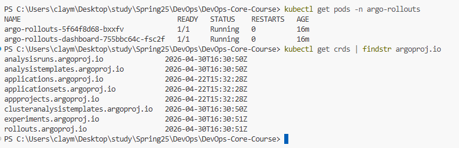
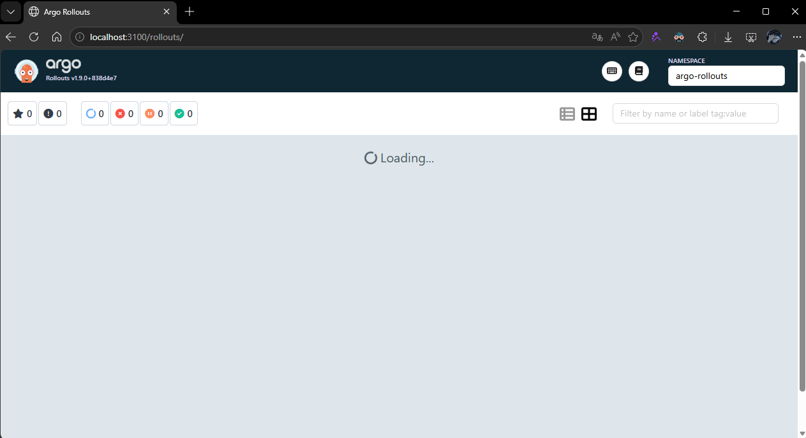
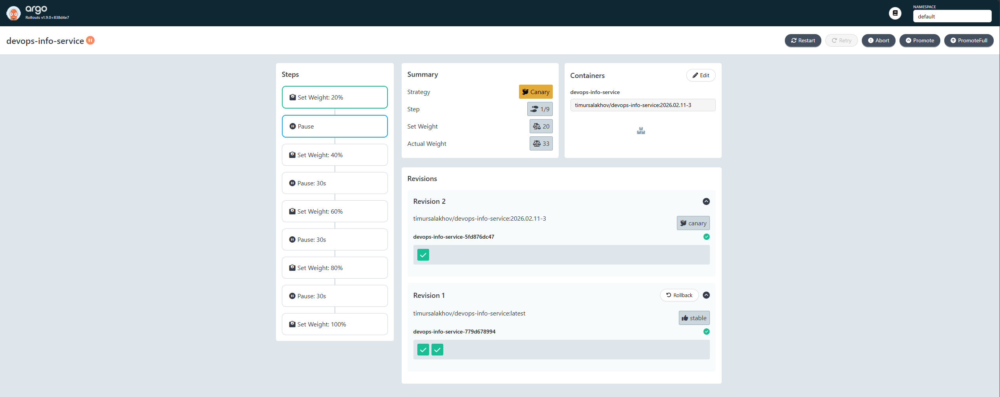
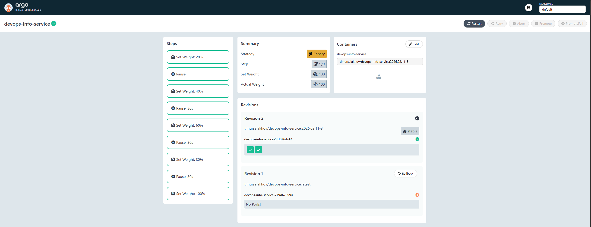
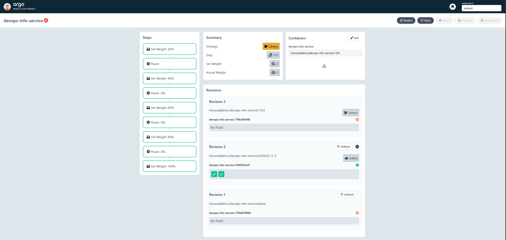
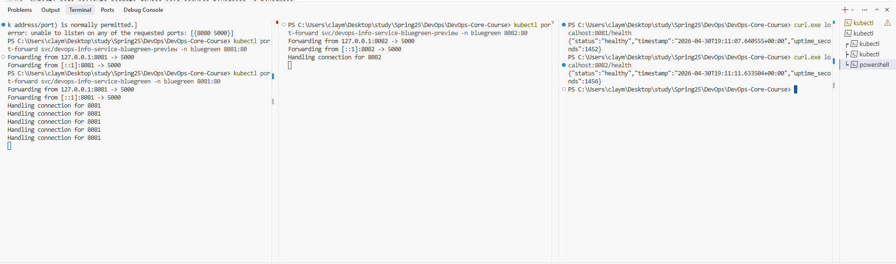
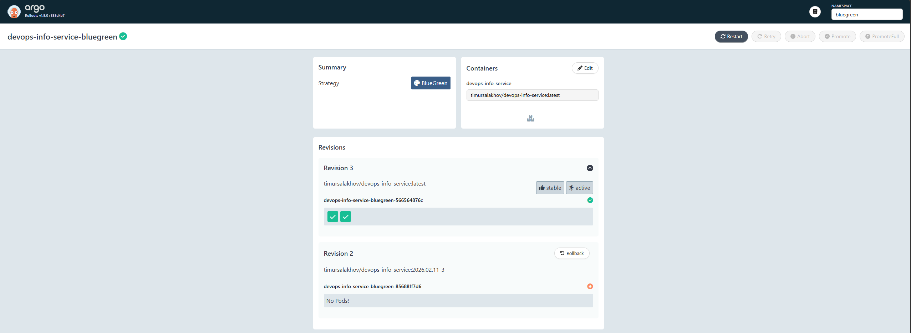
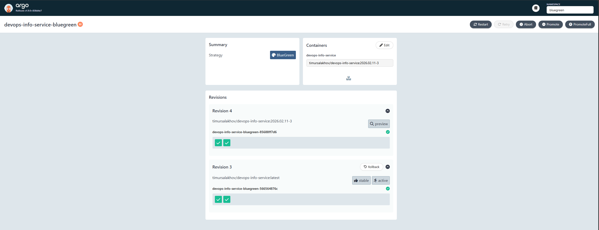
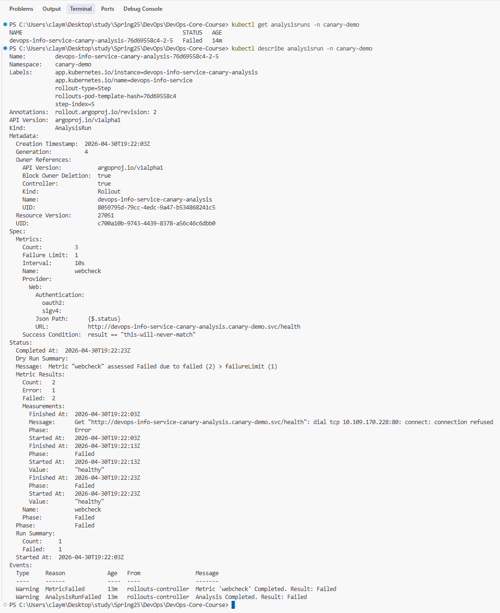

# Argo Rollouts — Progressive Delivery for the DevOps Info Service

This document covers the Lab 14 implementation: how the existing Helm chart was
converted from a `Deployment` to an Argo Rollouts `Rollout`, how canary and
blue-green strategies are configured, and how metrics-based analysis drives
automatic rollback.

---

## 1. Argo Rollouts Setup

### 1.1 Controller Installation

Argo Rollouts is installed in a dedicated `argo-rollouts` namespace using the
upstream manifests.

```powershell
# Create the namespace and install the controller
kubectl create namespace argo-rollouts
kubectl apply -n argo-rollouts -f https://github.com/argoproj/argo-rollouts/releases/latest/download/install.yaml

# Wait for the controller to become available
kubectl -n argo-rollouts wait --for=condition=available deployment/argo-rollouts --timeout=180s

# Verify
kubectl get pods -n argo-rollouts
kubectl get crds | findstr argoproj.io
```

Expected CRDs after installation:

```
analysisruns.argoproj.io
analysistemplates.argoproj.io
clusteranalysistemplates.argoproj.io
experiments.argoproj.io
rollouts.argoproj.io
```



### 1.2 kubectl Plugin Installation (Windows)

```powershell
$version = (Invoke-RestMethod "https://api.github.com/repos/argoproj/argo-rollouts/releases/latest").tag_name
Invoke-WebRequest `
  -Uri "https://github.com/argoproj/argo-rollouts/releases/download/$version/kubectl-argo-rollouts-windows-amd64.exe" `
  -OutFile "$env:USERPROFILE\kubectl-argo-rollouts.exe"
Move-Item "$env:USERPROFILE\kubectl-argo-rollouts.exe" "C:\Windows\System32\kubectl-argo-rollouts.exe"
kubectl argo rollouts version
```

Or just install binary from latest release at https://github.com/argoproj/argo-rollouts/releases

### 1.3 Dashboard Installation and Access

```powershell
kubectl apply -n argo-rollouts -f https://github.com/argoproj/argo-rollouts/releases/latest/download/dashboard-install.yaml

# Keep this running in a separate terminal
kubectl port-forward svc/argo-rollouts-dashboard -n argo-rollouts 3100:3100
# Browse http://localhost:3100
```



### 1.4 Rollout vs Deployment

`Rollout` is a drop-in replacement for `Deployment` with extra fields for
progressive delivery. Apart from the differences below, the `spec.template`
block (containers, env, volumes, probes) is **identical** to a Deployment.

| Field / Capability | `Deployment` | `Rollout` |
|---|---|---|
| `apiVersion` | `apps/v1` | `argoproj.io/v1alpha1` |
| Update strategy | `RollingUpdate`, `Recreate` | `canary`, `blueGreen` |
| Traffic shifting | rolling pod replacement only | weighted by replica count or by traffic-router |
| Pause / manual gates | none | `pause: {}` and `pause: { duration: 30s }` steps |
| Preview environment | none | dedicated `previewService` (blue-green) |
| Metric-driven promotion | none | `analysis` step + `AnalysisTemplate` |
| Automatic rollback | `kubectl rollout undo` (manual) | automatic on failed analysis or `abort` |
| CLI tooling | `kubectl rollout` | `kubectl argo rollouts` (richer: `promote`, `abort`, `retry`, `set image`) |
| GUI | none | dedicated dashboard (`argo-rollouts-dashboard`) |

In this chart the only structural change in [`templates/rollout.yaml`](devops-info-service/templates/rollout.yaml)
versus the deleted `templates/deployment.yaml` is `kind: Rollout` plus the new
`spec.strategy.canary` / `spec.strategy.blueGreen` block — the `Service` keeps
its existing selector and continues to route to whichever ReplicaSet the
controller marks as receiving traffic.

---

## 2. Canary Deployment

### 2.1 Strategy Configuration

The default chart values use the canary strategy. Steps live in
[`values.yaml`](devops-info-service/values.yaml) under `rollout.canary.steps`:

```yaml
rollout:
  strategy: canary
  canary:
    steps:
      - setWeight: 20
      - pause: {}                # manual promotion gate
      - setWeight: 40
      - pause: { duration: 30s }
      - setWeight: 60
      - pause: { duration: 30s }
      - setWeight: 80
      - pause: { duration: 30s }
      - setWeight: 100
```

The chart's [`templates/rollout.yaml`](devops-info-service/templates/rollout.yaml)
renders these steps directly into the Rollout `spec.strategy.canary.steps`
block. Because no traffic-router (NGINX/Istio) is configured, Argo Rollouts
performs **replica-based weighting**: with `replicaCount: 2` (default), 20% is
rounded to a single canary pod (so effectively 50% of traffic on a tiny demo).
For a more granular walkthrough use the `prod` env (5 replicas) or the
`canary-demo` namespace (3 replicas, see Bonus section).

### 2.2 Deploying the Canary App

```powershell
# Apply the ArgoCD Application (lab14 branch)
kubectl apply -f k8s/argocd/application.yaml
argocd app sync devops-info-service

# Confirm the Rollout is live
kubectl get rollouts -n default
kubectl argo rollouts get rollout devops-info-service -n default -w
```

### 2.3 Triggering a Rollout

Bump the image to start a canary rollout:

```powershell
kubectl argo rollouts set image devops-info-service `
  devops-info-service=timursalakhov/devops-info-service:latest -n default
```

The Rollout enters step 1 (`setWeight: 20`) and **pauses indefinitely** because
step 2 is `pause: {}` (manual gate). The dashboard shows `Paused — manual` and
the canary ReplicaSet sits at 1 pod.



### 2.4 Manual Promotion and Auto-Progression

```powershell
# Manually advance past step 2
kubectl argo rollouts promote devops-info-service -n default

# Watch the remaining 30s pauses tick down automatically
kubectl argo rollouts get rollout devops-info-service -n default -w
```

Steps 4, 6, 8 each sleep 30 seconds before promoting to the next weight, and
step 9 (`setWeight: 100`) marks the rollout `Healthy`.



### 2.5 Abort and Retry

While in mid-rollout, abort to immediately shift traffic back to the stable
ReplicaSet:

```powershell
# Trigger another rollout
kubectl argo rollouts set image devops-info-service `
  devops-info-service=timursalakhov/devops-info-service:1.0.0 -n default

# In the middle of progression, abort
kubectl argo rollouts abort devops-info-service -n default

# Confirm: canary scaled to 0, all traffic on stable
kubectl argo rollouts get rollout devops-info-service -n default

# Retry the aborted rollout if you want to continue
kubectl argo rollouts retry rollout devops-info-service -n default
```



---

## 3. Blue-Green Deployment

### 3.1 Strategy Configuration

The blue-green variant lives in
[`values-bluegreen.yaml`](devops-info-service/values-bluegreen.yaml). It flips
the strategy and disables the PVC (because two ReplicaSets run in parallel and
RWO PVCs can only be mounted by pods on a single node):

```yaml
rollout:
  strategy: blueGreen
  blueGreen:
    autoPromotionEnabled: false   # require manual promotion
    scaleDownDelaySeconds: 30      # keep old RS for 30s after promotion
persistence:
  enabled: false
```

[`templates/rollout.yaml`](devops-info-service/templates/rollout.yaml) wires up
the two services Argo Rollouts manages:

```yaml
strategy:
  blueGreen:
    activeService:  {{ include "common.fullname" . }}
    previewService: {{ include "common.fullname" . }}-preview
    autoPromotionEnabled: false
    scaleDownDelaySeconds: 30
```

The preview service is rendered conditionally by
[`templates/service-preview.yaml`](devops-info-service/templates/service-preview.yaml)
only when `rollout.strategy == blueGreen`. Both services point at the same pod
selector — the **rollouts controller** injects a
`rollouts-pod-template-hash` label onto each service to bind it to the active
or preview ReplicaSet.

### 3.2 Active vs Preview Service

| Service | Purpose | Selects |
|---|---|---|
| `devops-info-service` | production traffic | currently-active (blue) ReplicaSet |
| `devops-info-service-preview` | new version testing | newly-created (green) ReplicaSet |

`autoPromotionEnabled: false` means a human must call `kubectl argo rollouts
promote` to swap the active service onto the green ReplicaSet. Setting it to
`true` (or providing `autoPromotionSeconds`) flips automatically once the new
RS is healthy — useful for non-critical services.

### 3.3 Deploying Blue-Green

```powershell
kubectl apply -f k8s/argocd/application-bluegreen.yaml
argocd app sync devops-info-service-bluegreen

# Initial install: blue is the only RS, both services point at it
kubectl get rollout,svc -n bluegreen
```

### 3.4 Triggering a Green Deployment

```powershell
# Modify the image to deploy a "green" RS alongside the existing "blue"
kubectl argo rollouts set image devops-info-service `
  devops-info-service=timursalakhov/devops-info-service:latest -n bluegreen

kubectl argo rollouts get rollout devops-info-service -n bluegreen -w
```

The new RS scales up to full replica count while the active RS keeps serving
production traffic. The Rollout sits in `Paused — BlueGreenPause` until you
promote.

### 3.5 Verifying Preview vs Active

In two separate PowerShell terminals:

```powershell
# Terminal 1 — production (blue)
kubectl port-forward svc/devops-info-service -n bluegreen 8080:80
```

```powershell
# Terminal 2 — preview (green)
kubectl port-forward svc/devops-info-service-preview -n bluegreen 8081:80
```

```powershell
# Compare /health from both
curl http://localhost:8080/health
curl http://localhost:8081/health
```



### 3.6 Promotion (Instant Cutover)

```powershell
kubectl argo rollouts promote devops-info-service -n bluegreen
```

The active service's selector is rewritten in a single API call: traffic moves
from blue to green **instantly**, with no mixed routing window. After
`scaleDownDelaySeconds` the old RS is scaled to 0.



### 3.7 Instant Rollback

```powershell
kubectl argo rollouts undo devops-info-service -n bluegreen
```

`undo` triggers a new blue-green cycle that puts the previous image back on the
active service. Because the previous RS is still alive (within
`scaleDownDelaySeconds`) — or scaled back up immediately if past the window —
the cutover happens within seconds. Compare this to canary, where rolling
traffic back means draining each weighted step.



---

## 4. Strategy Comparison

| Dimension | Canary | Blue-Green |
|---|---|---|
| **Traffic mix during release** | Mixed: stable + canary serving simultaneously | Single version at any moment |
| **Granularity** | Percentage-based (per `setWeight`) | All-or-nothing |
| **Resource cost during release** | ~1x (extra canary pods only) | ~2x (both RS at full replicas) |
| **Rollback speed** | Slow — must drain weighted steps | **Instant** — selector swap |
| **Bake time / soak testing** | Per step (`pause` / metrics analysis) | Whole new RS available on `previewService` before promote |
| **Risk surface** | Limited blast radius via low weights | Full traffic moves at once on promote |
| **Best with** | high-volume web APIs, where issues surface in 1–5 min | DB/migration-aware deploys, low-traffic apps where preview testing matters |
| **Worst with** | apps incompatible with mixed versions (e.g. shared mutable state) | resource-constrained clusters |
| **Required infra for fine-grained traffic** | Service-mesh / Ingress traffic-router (NGINX, Istio) for sub-pod weights | None |

### Recommendation for this service

| Scenario | Choice |
|---|---|
| Day-to-day iterative changes (env tweak, dependency bump) | **Canary** with the 20%→pause→40/60/80/100 ladder; pause is a smoke-test gate. |
| Major refactors or breaking API contracts | **Blue-Green** with `autoPromotionEnabled: false` so QA can hit the preview Service before cutover. |
| Risky runtime upgrade (e.g. Python minor version) | **Canary with analysis** (Bonus) so the rollout aborts itself if `/health` regresses. |

---

## 5. CLI Reference

| Command | Purpose |
|---|---|
| `kubectl argo rollouts version` | Verify plugin is installed |
| `kubectl argo rollouts list rollouts -A` | List all rollouts cluster-wide |
| `kubectl argo rollouts get rollout <name> -n <ns>` | Snapshot of a single rollout (status, RS hash, images) |
| `kubectl argo rollouts get rollout <name> -n <ns> -w` | Stream live updates while the rollout progresses |
| `kubectl argo rollouts set image <rollout> <container>=<image> -n <ns>` | Trigger a rollout by changing the image (no Helm round-trip) |
| `kubectl argo rollouts promote <rollout> -n <ns>` | Skip the current pause / progress past a manual gate |
| `kubectl argo rollouts promote <rollout> --full -n <ns>` | Skip **all** remaining steps and go to 100% |
| `kubectl argo rollouts abort <rollout> -n <ns>` | Stop the rollout, route traffic back to stable |
| `kubectl argo rollouts retry rollout <rollout> -n <ns>` | Resume an aborted rollout from step 1 |
| `kubectl argo rollouts undo <rollout> -n <ns>` | Revert to the previous revision (blue-green: instant) |
| `kubectl argo rollouts pause <rollout> -n <ns>` / `unpause` | Force-pause/resume mid-rollout |
| `kubectl argo rollouts status <rollout> -n <ns>` | Exit-code-driven status (handy for CI gating) |
| `kubectl argo rollouts dashboard` | Launch the local dashboard pointing at current context |
| `kubectl describe analysisrun <name> -n <ns>` | Inspect an analysis attempt's metrics + failure reason |

---

## 6. Bonus — Automated Analysis

### 6.1 AnalysisTemplate

[`templates/analysistemplate.yaml`](devops-info-service/templates/analysistemplate.yaml)
defines a single `web` provider check that hits the application's `/health`
endpoint and asserts the JSON body contains `"status": "healthy"`:

```yaml
apiVersion: argoproj.io/v1alpha1
kind: AnalysisTemplate
metadata:
  name: success-rate
spec:
  metrics:
    - name: webcheck
      provider:
        web:
          url: http://devops-info-service.canary-demo.svc/health
          jsonPath: "{$.status}"
      successCondition: result == "healthy"
      interval: 10s
      count: 3
      failureLimit: 1
```

How metrics determine success / failure:
- `interval: 10s` — wait 10 seconds between probes.
- `count: 3` — run the probe 3 times.
- `successCondition: result == "healthy"` — each probe must return that value.
- `failureLimit: 1` — a **single** failed probe ends the run as `Failed`.

When the AnalysisRun ends `Failed`, Argo Rollouts treats it the same as a manual
`abort`: traffic shifts back to stable and the canary RS is scaled down.
Prometheus is **not required** here — we use the simpler `web` provider against
the in-cluster Service.

### 6.2 Wiring Analysis Into the Canary

[`values-canary-analysis.yaml`](devops-info-service/values-canary-analysis.yaml)
shortens the canary ladder and enables the analysis hook:

```yaml
rollout:
  strategy: canary
  canary:
    steps:
      - setWeight: 33
      - pause: { duration: 20s }
      - setWeight: 66
      - pause: { duration: 20s }
      - setWeight: 100
    analysis:
      enabled: true
      templateName: success-rate
```

The chart appends an `analysis` step at the end of `spec.strategy.canary.steps`
when `rollout.canary.analysis.enabled: true`:

```yaml
- analysis:
    templates:
      - templateName: success-rate
```

Deployed via [`k8s/argocd/application-canary-analysis.yaml`](argocd/application-canary-analysis.yaml)
into a dedicated `canary-demo` namespace.

### 6.3 Demonstrating Auto-Rollback

```powershell
kubectl apply -f k8s/argocd/application-canary-analysis.yaml
argocd app sync devops-info-service-canary-analysis

# Healthy rollout: AnalysisRun returns "healthy" -> rollout completes
kubectl argo rollouts set image devops-info-service `
  devops-info-service=timursalakhov/devops-info-service:latest -n canary-demo

# Force a failure: switch to an image that won't start (or doesn't exist)
kubectl argo rollouts set image devops-info-service `
  devops-info-service=timursalakhov/devops-info-service:does-not-exist -n canary-demo

kubectl argo rollouts get rollout devops-info-service -n canary-demo -w
kubectl get analysisruns -n canary-demo
kubectl describe analysisrun -n canary-demo
```

Expected sequence:
1. Rollout shifts 33% traffic to the new (broken) RS, pauses 20s.
2. Continues to 66%, pauses 20s.
3. Continues to 100% — but the AnalysisRun probe hits `/health` on the broken
   Service, gets a non-`healthy` response (or none), records a failure.
4. `failureLimit: 1` is reached → AnalysisRun status = `Failed`.
5. Rollout transitions to `Degraded`, traffic snaps back to the stable RS, the
   broken RS is scaled to 0.



---

## 7. File Inventory

| File | Purpose |
|---|---|
| [`k8s/devops-info-service/templates/rollout.yaml`](devops-info-service/templates/rollout.yaml) | Rollout (replaces `deployment.yaml`); supports both strategies via values |
| [`k8s/devops-info-service/templates/service-preview.yaml`](devops-info-service/templates/service-preview.yaml) | Preview Service rendered only for blue-green |
| [`k8s/devops-info-service/templates/analysistemplate.yaml`](devops-info-service/templates/analysistemplate.yaml) | Web-based AnalysisTemplate hitting `/health` |
| [`k8s/devops-info-service/values.yaml`](devops-info-service/values.yaml) | Base values (canary strategy, analysis disabled) |
| [`k8s/devops-info-service/values-bluegreen.yaml`](devops-info-service/values-bluegreen.yaml) | Override: `blueGreen` strategy, persistence off |
| [`k8s/devops-info-service/values-canary-analysis.yaml`](devops-info-service/values-canary-analysis.yaml) | Override: shorter canary + analysis enabled |
| [`k8s/argocd/application.yaml`](argocd/application.yaml) | ArgoCD app for canary in `default` ns |
| [`k8s/argocd/application-bluegreen.yaml`](argocd/application-bluegreen.yaml) | ArgoCD app for blue-green in `bluegreen` ns |
| [`k8s/argocd/application-canary-analysis.yaml`](argocd/application-canary-analysis.yaml) | ArgoCD app for canary-with-analysis in `canary-demo` ns |
