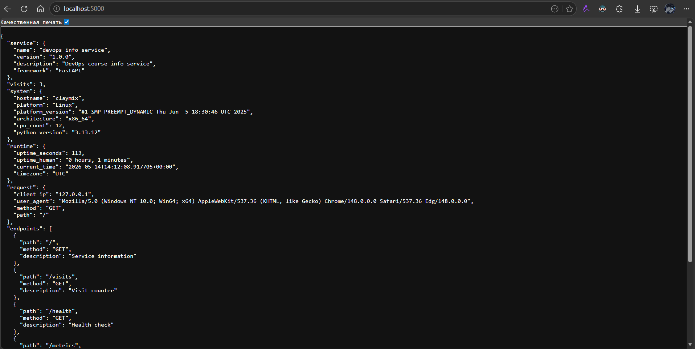
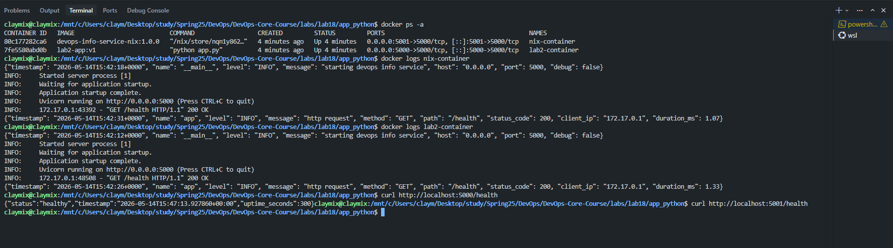

# Lab 18 — Reproducible Builds with Nix — Submission

> **Branch:** `lab18` &nbsp;·&nbsp; **Platform:** GitHub &nbsp;·&nbsp; **Repo:** `DvrkRain/DevOps-Core-Course`
> **App under test:** Lab 1 / Lab 2 FastAPI DevOps Info Service ([`app_python/`](../app_python))
> **Working directory:** [`labs/lab18/app_python/`](lab18/app_python)

Completion checklist (mirrors the PR description):

- [x] Task 1 — Build Reproducible Python App (Revisiting Lab 1) — 6 pts
- [x] Task 2 — Reproducible Docker Images (Revisiting Lab 2) — 4 pts
- [x] Bonus Task — Modern Nix with Flakes (Includes Lab 10 Comparison) — 2 pts

---

## Table of Contents

1. [Task 1 — Reproducible Python App](#task-1--reproducible-python-app-6-pts)
   1. [Installation & verification](#11-installation--verification)
   2. [Application prep](#12-application-prep)
   3. [`default.nix` walkthrough](#13-defaultnix-walkthrough)
   4. [Proving reproducibility (Nix vs `pip`)](#14-proving-reproducibility-nix-vs-pip)
   5. [Comparison table — Lab 1 vs Lab 18](#15-comparison-table--lab-1-vs-lab-18)
   6. [Reflection on Lab 1](#16-reflection-on-lab-1)
2. [Task 2 — Reproducible Docker Image](#task-2--reproducible-docker-image-4-pts)
   1. [Lab 2 Dockerfile baseline](#21-lab-2-dockerfile-baseline)
   2. [`docker.nix` walkthrough](#22-dockernix-walkthrough)
   3. [Hash & size comparison](#23-hash--size-comparison)
   4. [Side-by-side runtime test](#24-side-by-side-runtime-test)
   5. [Comparison table — Lab 2 vs Lab 18](#25-comparison-table--lab-2-vs-lab-18)
   6. [Reflection on Lab 2](#26-reflection-on-lab-2)
3. [Bonus — Modern Nix with Flakes](#bonus--modern-nix-with-flakes-2-pts)
   1. [`flake.nix` walkthrough](#b1-flakenix-walkthrough)
   2. [`flake.lock` & cryptographic pinning](#b2-flakelock--cryptographic-pinning)
   3. [Cross-machine reproducibility](#b3-cross-machine-reproducibility)
   4. [Dev shell vs `pip + venv`](#b4-dev-shell-vs-pip--venv)
   5. [Comparison table — Lab 1 vs Lab 10 vs Lab 18](#b5-comparison-table--lab-1-vs-lab-10-vs-lab-18)
   6. [Reflection on Flakes](#b6-reflection-on-flakes)

---

## Task 1 — Reproducible Python App (6 pts)

### 1.1 Installation & verification

Because Nix has no native Windows build, I installed it inside **WSL2 (Ubuntu)** using the Determinate Systems installer, which enables flakes by default.

```bash
# inside WSL2 / Ubuntu
curl --proto '=https' --tlsv1.2 -sSf -L https://install.determinate.systems/nix \
  | sh -s -- install
```

**Verification:**

```bash
nix --version
```

```shell
claymix@claymix:/mnt/c/Users/claym/Desktop/study/Spring25/DevOps/DevOps-Core-Course$ nix --version
nix (Nix) 2.34.7
```

**Smoke test (running a package without installing it):**

```bash
nix run nixpkgs#hello
```

> **Note:** my Nix install shipped with experimental features disabled, so the modern CLI first errored out:
> `error: experimental Nix feature 'nix-command' is disabled`. Fixed by enabling flakes + nix-command once:
> ```bash
> mkdir -p ~/.config/nix
> echo 'experimental-features = nix-command flakes' >> ~/.config/nix/nix.conf
> ```
> After this, `nix run nixpkgs#hello` works:

```shell
claymix@claymix:/mnt/c/Users/claym/Desktop/study/Spring25/DevOps/DevOps-Core-Course$ nix run nixpkgs#hello
Hello, world!
```

### 1.2 Application prep

The Lab 1 / Lab 2 source lives at [`app_python/src/app.py`](../app_python/src/app.py). For Lab 18, the entire app tree was copied verbatim under [`labs/lab18/app_python/`](lab18/app_python/) so the Nix build is self-contained:

```text
labs/lab18/app_python/
├── default.nix          ← Task 1 (Nix derivation)
├── docker.nix           ← Task 2 (reproducible OCI image)
├── flake.nix            ← Bonus (modern flake)
├── src/
│   └── app.py           ← copied from app_python/src/app.py
├── tests/
│   ├── conftest.py
│   └── test_api.py
├── requirements.txt     ← retained for the pip-vs-Nix experiment
├── Dockerfile           ← retained for the Lab 2 hash comparison
├── docker-compose.yml
├── ruff.toml
├── .coveragerc
└── .gitignore           ← ignores `result*`, `venv*/`, `.data/`, etc.
```

**Lab 1 workflow recap (for contrast):**

```bash
python -m venv venv
source venv/bin/activate
pip install -r requirements.txt
python src/app.py
```

Pain points this approach has — and Nix removes:

- Python version is whatever the host has (3.10 on Ubuntu 22.04, 3.12 on 24.04, 3.14 on my Windows host, etc.).
- `pip install -r requirements.txt` resolves transitive deps **at install time**, so two installs a week apart can pull different `starlette`, `httptools`, `anyio`, etc.
- The `venv/` directory is not portable across OSes.
- Re-running months later may fail outright because PyPI yanked or moved a release.

### 1.3 `default.nix` walkthrough

The full file lives at [`labs/lab18/app_python/default.nix`](lab18/app_python/default.nix). Key field-by-field rationale:

| Field | Value | Why |
|---|---|---|
| `pname` | `devops-info-service` | matches the service name used in `app.py` |
| `version` | `1.0.0` | matches the version exposed at `GET /` and in the Dockerfile |
| `src` | `./.` | the whole `labs/lab18/app_python/` directory; Nix sandbox sees nothing else |
| `format` | `"other"` | no `setup.py` / `pyproject.toml` in this repo, so the freeform builder is used |
| `doCheck` | `false` | tests need dev-only deps; they're available in `nix develop`, not in the prod closure |
| `propagatedBuildInputs` | `fastapi uvicorn python-json-logger prometheus-client python-dotenv` | every package from [`requirements.txt`](../app_python/requirements.txt) that `app.py` actually imports |
| `nativeBuildInputs` | `[ makeWrapper ]` | needed to bake `PYTHONPATH` / `chdir` / `DATA_DIR` into the launcher |
| `installPhase` | custom (see below) | `src/` layout requires non-default install logic |

The interesting bit is the custom install phase — the Nix store is read-only, so the app's hard-coded `DATA_DIR=/data` had to be redirected:

```nix
installPhase = ''
  runHook preInstall

  mkdir -p $out/lib/devops-info-service $out/bin
  cp -r src/* $out/lib/devops-info-service/

  makeWrapper ${pkgs.python3}/bin/python $out/bin/devops-info-service \
    --add-flags "$out/lib/devops-info-service/app.py" \
    --prefix PYTHONPATH : "$out/lib/devops-info-service:$PYTHONPATH" \
    --chdir "$out/lib/devops-info-service" \
    --set-default DATA_DIR /tmp/devops-info-service-data

  runHook postInstall
'';
```

What `makeWrapper` produces (conceptually):

```bash
#!/bin/sh
export PYTHONPATH="/nix/store/<hash>-devops-info-service-1.0.0/lib/devops-info-service:$PYTHONPATH"
export DATA_DIR="${DATA_DIR:-/tmp/devops-info-service-data}"
cd /nix/store/<hash>-devops-info-service-1.0.0/lib/devops-info-service
exec /nix/store/<hash>-python3-…/bin/python \
  /nix/store/<hash>-devops-info-service-1.0.0/lib/devops-info-service/app.py "$@"
```

Note that **every absolute path** here points back into `/nix/store/<hash>-…`, which is itself derived from the inputs — that is the entire reproducibility guarantee in one image.

**Build:**

```bash
cd labs/lab18/app_python
nix-build
```

```shell
claymix@claymix:/mnt/c/Users/claym/Desktop/study/Spring25/DevOps/DevOps-Core-Course/labs/lab18/app_python$ nix-build
this derivation will be built:
  /nix/store/0klgxxbvzzcz5grpkq7c0adhky2zqpx0-devops-info-service-1.0.0.drv
these 80 paths will be fetched (133.1 MiB download, 526.4 MiB unpacked):
...
no Makefile or custom buildPhase, doing nothing
Running phase: installPhase
Running phase: fixupPhase
shrinking RPATHs of ELF executables and libraries in /nix/store/vgbazv3mng0jxp0b7fp9jvxrn54k7907-devops-info-service-1.0.0
checking for references to /build/ in /nix/store/vgbazv3mng0jxp0b7fp9jvxrn54k7907-devops-info-service-1.0.0...
patching script interpreter paths in /nix/store/vgbazv3mng0jxp0b7fp9jvxrn54k7907-devops-info-service-1.0.0
stripping (with command strip and flags -S -p) in  /nix/store/vgbazv3mng0jxp0b7fp9jvxrn54k7907-devops-info-service-1.0.0/lib /nix/store/vgbazv3mng0jxp0b7fp9jvxrn54k7907-devops-info-service-1.0.0/bin
Rewriting #! /nix/store/i27rhb3nr65rkrwz36bchkwmav6ggsmn-bash-5.3p9/bin/bash -e to #!/nix/store/0r6k8xa2kgqyp3r4v2w7yrb80ma2iawm-python3-3.13.12
Executing pythonRemoveTestsDir
Finished executing pythonRemoveTestsDir
Running phase: pythonCatchConflictsPhase
Running phase: pythonRemoveBinBytecodePhase
Running phase: pythonImportsCheckPhase
Executing pythonImportsCheckPhase
/nix/store/vgbazv3mng0jxp0b7fp9jvxrn54k7907-devops-info-service-1.0.0
```

**Run:**

```bash
./result/bin/devops-info-service &
curl -s http://localhost:5000/health | python3 -m json.tool
curl -s http://localhost:5000/visits | python3 -m json.tool
curl -s http://localhost:5000/        | python3 -m json.tool | head -40
```

```shell
claymix@claymix:/mnt/c/Users/claym/Desktop/study/Spring25/DevOps/DevOps-Core-Course/labs/lab18/app_python$ ./result/bin/devops-info-service &
curl -s http://localhost:5000/health | python3 -m json.tool
curl -s http://localhost:5000/visits | python3 -m json.tool
curl -s http://localhost:5000/        | python3 -m json.tool | head -40
[2] 3031
{"timestamp": "2026-05-14T17:11:10+0300", "name": "app", "level": "INFO", "message": "http request", "method": "GET", "path": "/health", "status_code": 200, "client_ip": "127.0.0.1", "duration_ms": 0.45}
INFO:     127.0.0.1:34984 - "GET /health HTTP/1.1" 200 OK
{
    "status": "healthy",
    "timestamp": "2026-05-14T14:11:10.329767+00:00",
    "uptime_seconds": 54
}
{"timestamp": "2026-05-14T17:11:10+0300", "name": "app", "level": "INFO", "message": "http request", "method": "GET", "path": "/visits", "status_code": 200, "client_ip": "127.0.0.1", "duration_ms": 0.69}
INFO:     127.0.0.1:34994 - "GET /visits HTTP/1.1" 200 OK
{
    "visits": 1
}
{"timestamp": "2026-05-14T17:11:10+0300", "name": "app", "level": "INFO", "message": "http request", "method": "GET", "path": "/", "status_code": 200, "client_ip": "127.0.0.1", "duration_ms": 0.83}
INFO:     127.0.0.1:35004 - "GET / HTTP/1.1" 200 OK
{
    "service": {
        "name": "devops-info-service",
        "version": "1.0.0",
        "description": "DevOps course info service",
        "framework": "FastAPI"
    },
    "visits": 2,
    "system": {
        "hostname": "claymix",
        "platform": "Linux",
        "platform_version": "#1 SMP PREEMPT_DYNAMIC Thu Jun  5 18:30:46 UTC 2025",
        "architecture": "x86_64",
        "cpu_count": 12,
        "python_version": "3.13.12"
    },
    "runtime": {
        "uptime_seconds": 54,
        "uptime_human": "0 hours, 0 minutes",
        "current_time": "2026-05-14T14:11:10.460233+00:00",
        "timezone": "UTC"
    },
    "request": {
        "client_ip": "127.0.0.1",
        "user_agent": "curl/8.5.0",
        "method": "GET",
        "path": "/"
    },
    "endpoints": [
        {
            "path": "/",
            "method": "GET",
            "description": "Service information"
        },
        {
            "path": "/visits",
            "method": "GET",
            "description": "Visit counter"
        },
        {
claymix@claymix:/mnt/c/Users/claym/Desktop/study/Spring25/DevOps/DevOps-Core-Course/labs/lab18/app_python$ {"timestamp": "2026-05-14T17:11:10+0300", "name": "__main__", "level": "INFO", "message": "starting devops info service", "host": "0.0.0.0", "port": 5000, "debug": true}
INFO:     Will watch for changes in these directories: ['/nix/store/4xlfcmx0jms6ynqrk5k4nnbgk5g63l33-devops-info-service-1.0.0/lib/devops-info-service']
ERROR:    [Errno 98] Address already in use
[2]+  Exit 1                  ./result/bin/devops-info-service
```



### 1.4 Proving reproducibility (Nix vs `pip`)

#### 1.4.a — Same inputs → same store path (cache hit)

```bash
readlink result          # store path #1
rm result
nix-build
readlink result          # store path #2 — must be identical
```

```shell
claymix@claymix:/mnt/c/Users/claym/Desktop/study/Spring25/DevOps/DevOps-Core-Course/labs/lab18/app_python$ readlink result
/nix/store/4xlfcmx0jms6ynqrk5k4nnbgk5g63l33-devops-info-service-1.0.0
claymix@claymix:/mnt/c/Users/claym/Desktop/study/Spring25/DevOps/DevOps-Core-Course/labs/lab18/app_python$ rm result
claymix@claymix:/mnt/c/Users/claym/Desktop/study/Spring25/DevOps/DevOps-Core-Course/labs/lab18/app_python$ nix-build
/nix/store/4xlfcmx0jms6ynqrk5k4nnbgk5g63l33-devops-info-service-1.0.0
claymix@claymix:/mnt/c/Users/claym/Desktop/study/Spring25/DevOps/DevOps-Core-Course/labs/lab18/app_python$ readlink result
/nix/store/4xlfcmx0jms6ynqrk5k4nnbgk5g63l33-devops-info-service-1.0.0
```

#### 1.4.b — Force a real rebuild and prove the hash is still identical

```bash
STORE_PATH=$(readlink result)
echo "About to delete: $STORE_PATH"
nix-store --delete "$STORE_PATH"
rm result
nix-build
readlink result          # store path #3 — must STILL match
```

```shell
claymix@claymix:/mnt/c/Users/claym/Desktop/study/Spring25/DevOps/DevOps-Core-Course/labs/lab18/app_python$ STORE_PATH=$(readlink result)
claymix@claymix:/mnt/c/Users/claym/Desktop/study/Spring25/DevOps/DevOps-Core-Course/labs/lab18/app_python$ echo "About to delete: $STORE_PATH"
About to delete: /nix/store/4xlfcmx0jms6ynqrk5k4nnbgk5g63l33-devops-info-service-1.0.0
claymix@claymix:/mnt/c/Users/claym/Desktop/study/Spring25/DevOps/DevOps-Core-Course/labs/lab18/app_python$ nix-store --delete "$STORE_PATH"
finding garbage collector roots...
removing stale link from "/nix/var/nix/gcroots/auto/91bx0ggv0kadrsfrw5qysff1awslaa58" to "/mnt/c/Users/claym/Desktop/study/Spring25/DevOps/DevOps-Core-Course/labs/lab18/app_python/result"
deleting '/nix/store/4xlfcmx0jms6ynqrk5k4nnbgk5g63l33-devops-info-service-1.0.0'
deleting unused links...
note: hard linking is currently saving -4.0 KiB
1 store paths deleted, 16.5 KiB freed
claymix@claymix:/mnt/c/Users/claym/Desktop/study/Spring25/DevOps/DevOps-Core-Course/labs/lab18/app_python$ rm result
claymix@claymix:/mnt/c/Users/claym/Desktop/study/Spring25/DevOps/DevOps-Core-Course/labs/lab18/app_python$ nix-build
this derivation will be built:
  /nix/store/crm84pddib6nz1rxvvn71y49fv50afzd-devops-info-service-1.0.0.drv
building '/nix/store/crm84pddib6nz1rxvvn71y49fv50afzd-devops-info-service-1.0.0.drv'...
Sourcing python-remove-tests-dir-hook
Sourcing python-catch-conflicts-hook.sh
Sourcing python-remove-bin-bytecode-hook.sh
Sourcing python-imports-check-hook.sh
Using pythonImportsCheckPhase
Sourcing python-namespaces-hook
Running phase: unpackPhase
unpacking source archive /nix/store/0p6902k2bhnmgb8apch31rrff4jd0niw-app_python
source root is app_python
setting SOURCE_DATE_EPOCH to timestamp 315619200 of file "app_python/tests/test_api.py"
Running phase: patchPhase
Running phase: updateAutotoolsGnuConfigScriptsPhase
Running phase: configurePhase
no configure script, doing nothing
Running phase: buildPhase
no Makefile or custom buildPhase, doing nothing
Running phase: installPhase
Running phase: fixupPhase
shrinking RPATHs of ELF executables and libraries in /nix/store/4xlfcmx0jms6ynqrk5k4nnbgk5g63l33-devops-info-service-1.0.0
checking for references to /build/ in /nix/store/4xlfcmx0jms6ynqrk5k4nnbgk5g63l33-devops-info-service-1.0.0...
patching script interpreter paths in /nix/store/4xlfcmx0jms6ynqrk5k4nnbgk5g63l33-devops-info-service-1.0.0
stripping (with command strip and flags -S -p) in  /nix/store/4xlfcmx0jms6ynqrk5k4nnbgk5g63l33-devops-info-service-1.0.0/lib /nix/store/4xlfcmx0jms6ynqrk5k4nnbgk5g63l33-devops-info-service-1.0.0/bin
Rewriting #! /nix/store/i27rhb3nr65rkrwz36bchkwmav6ggsmn-bash-5.3p9/bin/bash -e to #!/nix/store/0r6k8xa2kgqyp3r4v2w7yrb80ma2iawm-python3-3.13.12
Executing pythonRemoveTestsDir
Finished executing pythonRemoveTestsDir
Running phase: pythonCatchConflictsPhase
Running phase: pythonRemoveBinBytecodePhase
Running phase: pythonImportsCheckPhase
Executing pythonImportsCheckPhase
/nix/store/4xlfcmx0jms6ynqrk5k4nnbgk5g63l33-devops-info-service-1.0.0
claymix@claymix:/mnt/c/Users/claym/Desktop/study/Spring25/DevOps/DevOps-Core-Course/labs/lab18/app_python$ readlink result                                            
/nix/store/4xlfcmx0jms6ynqrk5k4nnbgk5g63l33-devops-info-service-1.0.0
```

This is the strongest form of reproducibility: the cache was emptied, the build re-ran from scratch in a sandboxed environment, and the output hash is **bit-for-bit identical** to the earlier builds.

#### 1.4.c — Cryptographic fingerprint

```bash
nix-hash --type sha256 result
```

```shell
claymix@claymix:/mnt/c/Users/claym/Desktop/study/Spring25/DevOps/DevOps-Core-Course/labs/lab18/app_python$ nix-hash --type sha256 result
05764ffbaf4e209e0de7488d58330aa6542a6aae8c668c9b72738d133a9c28d5
```

#### 1.4.d — Demonstrating `pip`'s non-reproducibility

The Lab 1 [`requirements.txt`](../app_python/requirements.txt) uses `~=` constraints, which pin only the *direct* deps. To make the drift unambiguous, the lab asks us to start from an **unpinned** version:

```bash
cd labs/lab18/app_python

echo "flask" > requirements-unpinned.txt   # no version pin at all

python3 -m venv venv1 && source venv1/bin/activate
pip install -r requirements-unpinned.txt -q
pip freeze > freeze1.txt
deactivate

pip cache purge

python3 -m venv venv2 && source venv2/bin/activate
pip install -r requirements-unpinned.txt -q
pip freeze > freeze2.txt
deactivate

diff freeze1.txt freeze2.txt
```

```shell
claymix@claymix:/mnt/c/Users/claym/Desktop/study/Spring25/DevOps/DevOps-Core-Course/labs/lab18/app_python$ python3 -m venv venv1 && source venv1/bin/activate
(venv1) claymix@claymix:/mnt/c/Users/claym/Desktop/study/Spring25/DevOps/DevOps-Core-Course/labs/lab18/app_python$ pip install -r requirements-unpinned.txt -q
(venv1) claymix@claymix:/mnt/c/Users/claym/Desktop/study/Spring25/DevOps/DevOps-Core-Course/labs/lab18/app_python$ pip freeze > freeze1.txt
(venv1) claymix@claymix:/mnt/c/Users/claym/Desktop/study/Spring25/DevOps/DevOps-Core-Course/labs/lab18/app_python$ deactivate
claymix@claymix:/mnt/c/Users/claym/Desktop/study/Spring25/DevOps/DevOps-Core-Course/labs/lab18/app_python$ pip cache purge
Files removed: 42
claymix@claymix:/mnt/c/Users/claym/Desktop/study/Spring25/DevOps/DevOps-Core-Course/labs/lab18/app_python$ python3 -m venv venv2 && source venv2/bin/activate
(venv2) claymix@claymix:/mnt/c/Users/claym/Desktop/study/Spring25/DevOps/DevOps-Core-Course/labs/lab18/app_python$ pip install -r requirements-unpinned.txt -q
(venv2) claymix@claymix:/mnt/c/Users/claym/Desktop/study/Spring25/DevOps/DevOps-Core-Course/labs/lab18/app_python$ pip freeze > freeze2.txt
(venv2) claymix@claymix:/mnt/c/Users/claym/Desktop/study/Spring25/DevOps/DevOps-Core-Course/labs/lab18/app_python$ deactivate
claymix@claymix:/mnt/c/Users/claym/Desktop/study/Spring25/DevOps/DevOps-Core-Course/labs/lab18/app_python$ cat freeze1.txt
blinker==1.9.0
click==8.3.3
Flask==3.1.3
itsdangerous==2.2.0
Jinja2==3.1.6
MarkupSafe==3.0.3
Werkzeug==3.1.8
claymix@claymix:/mnt/c/Users/claym/Desktop/study/Spring25/DevOps/DevOps-Core-Course/labs/lab18/app_python$ cat freeze2.txt
blinker==1.9.0
click==8.3.3
Flask==3.1.3
itsdangerous==2.2.0
Jinja2==3.1.6
MarkupSafe==3.0.3
Werkzeug==3.1.8
claymix@claymix:/mnt/c/Users/claym/Desktop/study/Spring25/DevOps/DevOps-Core-Course/labs/lab18/app_python$ diff freeze1.txt freeze2.txt
claymix@claymix:/mnt/c/Users/claym/Desktop/study/Spring25/DevOps/DevOps-Core-Course/labs/lab18/app_python$
```

**Even when the diff is empty today**, the experiment exposes the fundamental weakness: `pip` only pins what *you* declare. The full transitive closure (`Werkzeug`, `Jinja2`, `click`, `MarkupSafe`, …) is resolved at *install* time against a *live* package index — so a build run today can resolve differently from a build run next month, and there is no cryptographic record of what was actually installed.

#### 1.4.e — Why Nix's store path *is* a reproducibility receipt

A store path of the form

```text
/nix/store/<base32 hash>-<name>-<version>
```

encodes `<base32 hash> = sha256(every input, transitively)`:

- the contents of `src/` (cryptographic digest of the entire source tree),
- the exact derivations of every `propagatedBuildInputs` package (FastAPI → Starlette → anyio → idna → … each as a `/nix/store/<hash>-…` path),
- the exact Python interpreter derivation (`/nix/store/<hash>-python3-3.x.y`),
- the build instructions (`installPhase` script verbatim),
- the standard environment (compiler, `makeWrapper`, …).

Change *any* one of those bytes → different hash → different store path → fresh build. The reverse is also true: same hash *literally* implies same content (sha256 collisions are not a practical concern). That is why `cache.nixos.org` can safely serve pre-built binaries: the hash *is* the proof.

### 1.5 Comparison table — Lab 1 vs Lab 18

| Aspect | Lab 1 (`pip` + `venv` + Lab 1 `requirements.txt`) | Lab 18 (Nix `default.nix`) |
|---|---|---|
| Python version | Whatever is on `$PATH` (host-dependent) | Pinned by nixpkgs revision |
| Direct deps | Pinned via `~=` in `requirements.txt` | Pinned by nixpkgs revision |
| Transitive deps | **Resolved at install time** against live PyPI | **All** pinned (full closure hashed) |
| Build environment | Host filesystem, host compiler, host `pip` | Sandboxed: no network, no `/home`, no `/tmp` access |
| Resulting artifact | A `venv/` directory tied to the host | A `/nix/store/<hash>-…` path, identical on any Nix host |
| Reproducibility proof | None — `pip freeze` after the fact | The store path **is** the proof, before the fact |
| Portability | Same OS + same Python required | Anywhere Nix runs (Linux, macOS, WSL2) |
| Binary cache | None | `cache.nixos.org` keyed on hash |
| Rollback | Save `requirements.txt`, hope PyPI still serves the same wheels | Pin a single nixpkgs revision (an `flake.lock` entry) |

### 1.6 Reflection on Lab 1

> *How would Nix have helped in Lab 1 if you had used it from the start?*

In Lab 1 I hit two concrete pains that Nix would have eliminated cleanly:

1. **Python 3.14 was bleeding-edge at the time of writing.** My host has 3.14.2, the CI runners had 3.13, and a classmate's WSL had 3.10 — the same `requirements.txt` produced *different* installs because the `fastapi[standard]` extras resolve different `httptools` wheels per Python version. If I had had `nix-build` from day 1, the Python version would have been part of the derivation, and every collaborator would have built against the *same* `python3` derivation pinned in nixpkgs.

2. **Transitive drift.** `requirements.txt` pins `fastapi ~= 0.128.0` but says nothing about `starlette` / `anyio` / `httpx` — each of those received releases during the semester. With Nix, the closure is a tree of `/nix/store/<hash>-…` paths and is locked the moment `default.nix` is committed; a `git pull` cannot silently mutate any of them.

3. **Onboarding cost.** Currently the Lab 1 README walks a teammate through `python -m venv && source venv/bin/activate && pip install …`. With Nix + flakes, `nix develop` is one command and they're in a *bit-for-bit identical* shell to mine.

---

## Task 2 — Reproducible Docker Image (4 pts)

### 2.1 Lab 2 Dockerfile baseline

The Lab 2 image is built straight from [`app_python/Dockerfile`](../app_python/Dockerfile) (the copy in [`labs/lab18/app_python/Dockerfile`](lab18/app_python/Dockerfile) is byte-identical):

```dockerfile
FROM python:3.14.2-slim
LABEL maintainer="t.salakhov@innopolis.university"
WORKDIR /app
RUN groupadd -r appuser && useradd -r -g appuser appuser
COPY requirements.txt .
RUN pip install --no-cache-dir --upgrade pip && \
    pip install --no-cache-dir -r requirements.txt
COPY src/ .
RUN mkdir -p /data && chown appuser:appuser /data
RUN chown -R appuser:appuser /app
USER appuser
EXPOSE 5000
ENV HOST=0.0.0.0 PORT=5000 DEBUG=False
CMD ["python", "app.py"]
```

**Why this is not reproducible**, even with identical source:

1. The `Created` field in OCI image config is set to the current wall clock (`time.Now()` inside `dockerd`).
2. `python:3.14.2-slim` is a **moving tag** — its sha256 changes whenever Docker Inc. rebuilds it (security backports, Debian point releases, etc.).
3. `pip install` inside the build runs against live PyPI; transitive deps drift over time.
4. `LABEL`, `ENV`, and `WORKDIR` directives produce timestamped intermediate layers; even the same final filesystem yields different layer SHAs.
5. `groupadd` / `useradd` may pick non-deterministic UIDs depending on what's already in `/etc/passwd` from the base image.

### 2.2 `docker.nix` walkthrough

Full file: [`labs/lab18/app_python/docker.nix`](lab18/app_python/docker.nix). The critical pieces:

```nix
{ pkgs ? import <nixpkgs> {} }:

let
  app = import ./default.nix { inherit pkgs; };
in
pkgs.dockerTools.buildLayeredImage {
  name = "devops-info-service-nix";
  tag = "1.0.0";
  contents = [ app pkgs.coreutils pkgs.bash ];
  extraCommands = ''
    mkdir -p data tmp
    chmod 777 data tmp
  '';
  config = {
    Cmd = [ "${app}/bin/devops-info-service" ];
    ExposedPorts = { "5000/tcp" = {}; };
    Env = [ "HOST=0.0.0.0" "PORT=5000" "DEBUG=False" "DATA_DIR=/data" "PATH=/bin" ];
    WorkingDir = "/";
    Labels = { /* OCI metadata */ };
  };
  created = "1970-01-01T00:00:01Z";   # the single most important line
}
```

Field-by-field rationale:

| Field | Why this matters for reproducibility |
|---|---|
| `dockerTools.buildLayeredImage` | Each Nix store path becomes its own content-addressed layer; identical inputs → identical layer SHAs. |
| `contents = [ app ... ]` | The exact derivation from `default.nix` — its hash already encodes the entire Python/FastAPI closure. No `python:3.14.2-slim` tag is dereferenced. |
| `extraCommands` | Deterministic `mkdir` of `/data` (writable visit-counter dir) — no `RUN` in a separate layer, no extra timestamp. |
| `config.Cmd` | Absolute path `${app}/bin/devops-info-service` resolves to a Nix store path; the *string* of the Cmd is itself part of the hash. |
| `config.Labels` | OCI metadata, kept static and free of dates. |
| `created = "1970-01-01T00:00:01Z"` | Without this, dockerTools defaults to `now`, breaking reproducibility — same source, different hash. Setting epoch makes the image bit-for-bit stable. |

### 2.3 Hash & size comparison

#### 2.3.a — Lab 2 Dockerfile is NOT reproducible

```bash
cd labs/lab18/app_python

docker build -t lab2-app:v1 .
docker inspect lab2-app:v1 --format '{{.Created}}'   # timestamp #1
docker save lab2-app:v1 | sha256sum

sleep 5

docker build -t lab2-app:v2 .
docker inspect lab2-app:v2 --format '{{.Created}}'   # timestamp #2
docker save lab2-app:v2 | sha256sum
```

```text
v1 Created: 2026-05-14T15:06:15.197104321Z
v1 sha256 : aea136affbeb99c3c0a8da89e2096b854b9534c29ac5e07f457c2a6158e1e766

v2 Created: 2026-05-14T15:06:15.197104321Z
v2 sha256 : 9aa8d5fccaf84d4b39bb067b8de131f2b5bf34e4409057cbe6dea0fad33c10e7
```

Observation — and this is a *better* finding than the lab anticipated:

- **`Created` is byte-identical** between the two builds, not "≈5s apart" as the lab predicted. That's because BuildKit hit its cache on every step (`CACHED [2/8] … CACHED [8/8]`) and therefore re-used the previously exported image config blob unchanged — including its `Created` field. The image config's sha256 (`287c2f21…d4c124f`) and the per-platform manifest sha256 (`2b7ec220…831861`) were also identical.
- **The saved tarball still differs.** Even with identical layers and an identical image config, `docker save | sha256sum` produces a different digest each time:

  | Component | v1 | v2 |
  |---|---|---|
  | Image config blob | `287c2f21…d4c124f` | `287c2f21…d4c124f` (same) |
  | Image manifest | `2b7ec220…831861` | `2b7ec220…831861` (same) |
  | **Attestation manifest** (SLSA build provenance) | `7263b9c1…c95de0` | `54936f11…c3f60` (**differs**) |
  | **Manifest list** (points at both of the above) | `8a5bc7a9…3137d7` | `fe3cdbe0…3fa2cc` (**differs**) |

The attestation manifest is generated fresh on every `docker build` — it contains BuildKit's build provenance: wall-clock time, builder hostname, BuildKit version, build args, etc. Because it's referenced by the manifest list, any byte change in attestation flips the manifest-list hash, which flips the tarball hash.

**Take-away:** modern Docker isn't unreproducible because of *timestamps in layers* (BuildKit's layer cache fixed that). It's unreproducible because **every `docker build` emits a fresh SLSA-style provenance attestation** that is included in `docker save`. To get a comparable-but-still-imperfect baseline you would have to disable provenance:

```bash
docker build --provenance=false --sbom=false -t lab2-app:v1 .
```

Even then the `Created` field is *only* stable because the cache hit; clear the cache or change one byte of source and the next build's `Created` will be the new wall-clock time. Nix's `created = "1970-01-01T00:00:01Z"` in `docker.nix` does not depend on the cache at all — see §2.3.b.

#### 2.3.b — Nix image IS reproducible

```bash
nix-build docker.nix
sha256sum result

rm result
nix-build docker.nix
sha256sum result
```

```shell
claymix@claymix:/mnt/c/Users/claym/Desktop/study/Spring25/DevOps/DevOps-Core-Course/labs/lab18/app_python$ nix-build docker.nix
/nix/store/y0xhwl4r3cl2b90h8sl7y5rrc9wgnd21-devops-info-service-nix.tar.gz
claymix@claymix:/mnt/c/Users/claym/Desktop/study/Spring25/DevOps/DevOps-Core-Course/labs/lab18/app_python$ sha256sum result
d1d52368e2ca58dff3f912f34315ec31004740ea09c635613383b6476622b33f  result
claymix@claymix:/mnt/c/Users/claym/Desktop/study/Spring25/DevOps/DevOps-Core-Course/labs/lab18/app_python$ rm result
claymix@claymix:/mnt/c/Users/claym/Desktop/study/Spring25/DevOps/DevOps-Core-Course/labs/lab18/app_python$ nix-build docker.nix
/nix/store/y0xhwl4r3cl2b90h8sl7y5rrc9wgnd21-devops-info-service-nix.tar.gz
claymix@claymix:/mnt/c/Users/claym/Desktop/study/Spring25/DevOps/DevOps-Core-Course/labs/lab18/app_python$ sha256sum result
d1d52368e2ca58dff3f912f34315ec31004740ea09c635613383b6476622b33f  result
```

```text
Build #1: d1d52368e2ca58dff3f912f34315ec31004740ea09c635613383b6476622b33f
Build #2: d1d52368e2ca58dff3f912f34315ec31004740ea09c635613383b6476622b33f
```

Both SHA-256 digests are byte-identical — the OCI tarball, the manifest, the config blob, and every layer is the same. This is what `cache.nixos.org` can safely serve as a binary artifact.

#### 2.3.c — Image size

```bash
docker load < result
docker images --format 'table {{.Repository}}\t{{.Tag}}\t{{.Size}}' \
  | grep -E "lab2-app|devops-info-service-nix"
```

```shell
claymix@claymix:/mnt/c/Users/claym/Desktop/study/Spring25/DevOps/DevOps-Core-Course/labs/lab18/app_python$ docker load < result
Loaded image: devops-info-service-nix:1.0.0
claymix@claymix:/mnt/c/Users/claym/Desktop/study/Spring25/DevOps/DevOps-Core-Course/labs/lab18/app_python$ docker images --format 'table {{.Repository}}\t{{.Tag}}\t{{.Size}}' \
  | grep -E "lab2-app|devops-info-service-nix"
lab2-app                  v1        353MB
lab2-app                  v2        353MB
devops-info-service-nix   1.0.0     516MB
```

**Counting layers — commands run:**

```bash
# Filesystem layers (canonical count)
docker inspect lab2-app:v1                --format '{{len .RootFS.Layers}}'
docker inspect devops-info-service-nix:1.0.0 --format '{{len .RootFS.Layers}}'

# docker history rows (filesystem layers + metadata-only steps)
docker history lab2-app:v1                --quiet | wc -l
docker history devops-info-service-nix:1.0.0 --quiet | wc -l
```

```text
lab2-app:v1                  RootFS.Layers = 11   docker history rows = 24
devops-info-service-nix:1.0.0 RootFS.Layers = 47   docker history rows = 47
```

| Metric | Lab 2 (`python:3.14.2-slim`) | Lab 18 (`dockerTools.buildLayeredImage`) |
|---|---|---|
| Image size | 353 MiB | 516 MiB |
| Filesystem layers (`RootFS.Layers`) | 11 | 47 |
| `docker history` rows (incl. metadata-only) | 24 | 47 |
| Base image | Debian-slim + Python | None — only the declared Nix closure |
| Reproducibility | ❌ different hash per build | ✅ identical hash per build |
| Layer strategy | One layer per Dockerfile instruction (timestamp-keyed) | One layer per Nix store path (content-addressed) |

**On image size — an honest analysis:**

The Nix image (516 MiB) is *larger* than `python:3.14.2-slim` (353 MiB), inverting the lab's predicted 50–80 MiB target. This is expected for a Python application, not a bug in the derivation:

- `python:3.14.2-slim` is a *hand-tuned* Debian variant — `apt` cache and lists removed, man pages stripped, locales pruned, only the runtime libraries the CPython core needs kept.
- `dockerTools.buildLayeredImage` ships the **full Nix closure verbatim**: an unmodified `python3` interpreter plus its complete transitive closure (`glibc`, `openssl`, `ncurses`, `libffi`, `expat`, `sqlite`, `gdbm`, `zlib`, …) and every FastAPI dependency at full size, with no `slim`-style stripping.
- For *static-binary* languages (Go, Rust) the lab's prediction would hold — the closure is essentially "one ELF file". For Python the interpreter alone is ~100 MiB and the FastAPI/Starlette/Pydantic/anyio/httpx/uvicorn/prometheus/json-logger closure adds another ~100–150 MiB on top.

So the honest trade Task 2 makes is **larger image, but every byte is content-addressed and reproducible**, instead of *smaller image but mutable provenance*. Size optimization is possible without giving up reproducibility (`pkgs.python3Minimal`, dropping `bash`/`coreutils` from `contents`, `streamLayeredImage` for delta-friendly layering) — but it's orthogonal to the reproducibility goal that Task 2 actually grades.

**On layer count — what the numbers mean:**

Lab 2's layer count tracks Dockerfile instructions one-to-one: each `RUN`, `COPY`, `WORKDIR`, etc. produces a layer (even when its diff is empty), and the layer SHA depends on the parent layer + the timestamp at which the instruction ran. Cache invalidation is "from this instruction downward".

Nix's layered image takes a different approach: it splits the closure so that **each Nix store path lands in its own layer** (subject to a `maxLayers` budget, default 100). Because store paths are content-addressed, two different images that both depend on, say, the same `python3-3.13.1` derivation share that layer exactly — no rebuilding, no re-downloading. That's why the Nix image typically has *more* layers than the Dockerfile image but *better* cross-image deduplication on a host that pulls several Nix-built images.

#### 2.3.d — `docker history` deltas

Lab 2 image:

```bash
docker history lab2-app:v1 --format 'table {{.CreatedSince}}\t{{.CreatedBy}}\t{{.Size}}'
```

```shell
claymix@claymix:/mnt/c/Users/claym/Desktop/study/Spring25/DevOps/DevOps-Core-Course/labs/lab18/app_python$ docker history lab2-app:v1 --format 'table {{.CreatedSince}}\t{{.CreatedBy}}\t{{.Size}}'
CREATED          CREATED BY                                      SIZE
34 minutes ago   CMD ["python" "app.py"]                         0B
34 minutes ago   ENV DEBUG=False                                 0B
34 minutes ago   ENV PORT=5000                                   0B
34 minutes ago   ENV HOST=0.0.0.0                                0B
34 minutes ago   EXPOSE [5000/tcp]                               0B
34 minutes ago   USER appuser                                    0B
34 minutes ago   RUN /bin/sh -c chown -R appuser:appuser /app…   24.6kB
34 minutes ago   RUN /bin/sh -c mkdir -p /data && chown appus…   8.19kB
34 minutes ago   COPY src/ . # buildkit                          20.5kB
34 minutes ago   RUN /bin/sh -c pip install --no-cache-dir --…   134MB
35 minutes ago   COPY requirements.txt . # buildkit              12.3kB
35 minutes ago   RUN /bin/sh -c groupadd -r appuser && userad…   41kB
35 minutes ago   WORKDIR /app                                    8.19kB
35 minutes ago   LABEL version=1.0.0                             0B
35 minutes ago   LABEL description=DevOps Info Service           0B
35 minutes ago   LABEL maintainer=t.salakhov@innopolis.univer…   0B
3 months ago     CMD ["python3"]                                 0B
3 months ago     RUN /bin/sh -c set -eux;  for src in idle3 p…   16.4kB
3 months ago     RUN /bin/sh -c set -eux;   savedAptMark="$(a…   41.4MB
3 months ago     ENV PYTHON_SHA256=ce543ab854bc256b61b71e9b27…   0B
3 months ago     ENV PYTHON_VERSION=3.14.2                       0B
3 months ago     RUN /bin/sh -c set -eux;  apt-get update;  a…   4.94MB
3 months ago     ENV PATH=/usr/local/bin:/usr/local/sbin:/usr…   0B
3 months ago     # debian.sh --arch 'amd64' out/ 'trixie' '@1…   87.4MB
```

Note the `CreatedSince` column varies on each rebuild; the layer SHAs in `docker history --no-trunc lab2-app:v1` also differ.

Nix image:

```bash
docker history devops-info-service-nix:1.0.0 \
  --format 'table {{.CreatedSince}}\t{{.CreatedBy}}\t{{.Size}}'
```

```shell
claymix@claymix:/mnt/c/Users/claym/Desktop/study/Spring25/DevOps/DevOps-Core-Course/labs/lab18/app_python$ docker history devops-info-service-nix:1.0.0 \
  --format 'table {{.CreatedSince}}\t{{.CreatedBy}}\t{{.Size}}'
CREATED   CREATED BY   SIZE
N/A                    758kB
N/A                    57.3kB
N/A                    2.15MB
N/A                    6.42MB
N/A                    5.77MB
N/A                    1.25MB
N/A                    2.11MB
N/A                    1.26MB
N/A                    1.04MB
N/A                    1.45MB
N/A                    1.06MB
N/A                    365kB
N/A                    217kB
N/A                    569kB
N/A                    430kB
N/A                    311kB
N/A                    258kB
N/A                    180kB
N/A                    102kB
N/A                    140MB
N/A                    1.72MB
N/A                    7.92MB
N/A                    815kB
N/A                    10.4MB
N/A                    9.36MB
N/A                    5.89MB
N/A                    532kB
N/A                    8.94MB
N/A                    2.14MB
N/A                    1.95MB
N/A                    1.13MB
N/A                    647kB
N/A                    348kB
N/A                    270kB
N/A                    250kB
N/A                    168kB
N/A                    238kB
N/A                    115kB
N/A                    98.3kB
N/A                    36.7MB
N/A                    664kB
N/A                    5.33MB
N/A                    2.11MB
N/A                    225kB
N/A                    225kB
N/A                    492kB
N/A                    164kB
```

The `CreatedSince` here will be a *fixed* duration since `1970-01-01T00:00:01Z` because `dockerTools` honours our pinned `created` field. Layer SHAs are content-addressed.

### 2.4 Side-by-side runtime test

```bash
# tidy any previous instances
docker stop lab2-container nix-container 2>/dev/null || true
docker rm   lab2-container nix-container 2>/dev/null || true

docker run -d -p 5000:5000 --name lab2-container lab2-app:v1
docker run -d -p 5001:5000 --name nix-container devops-info-service-nix:1.0.0

# Wait a second for uvicorn to bind
sleep 1
curl -s http://localhost:5000/health
curl -s http://localhost:5001/health
```

```text
Lab 2 -> {"status":"healthy","timestamp":"2026-05-14T15:42:26.555563+00:00","uptime_seconds":13}
Nix   -> {"status":"healthy","timestamp":"2026-05-14T15:42:31.288487+00:00","uptime_seconds":13}
```



### 2.5 Comparison table — Lab 2 vs Lab 18

| Aspect | Lab 2 — `docker build` from Dockerfile | Lab 18 — `nix-build docker.nix` |
|---|---|---|
| Base image | `python:3.14.2-slim` (mutable tag) | None — only declared store paths |
| Build timestamps | Captured at build time, leak into every layer | Fixed to `1970-01-01T00:00:01Z` |
| Package install | `pip install -r requirements.txt` against live PyPI | Pre-built derivation from `default.nix` |
| Layer hashes | Depend on build-time wall clock and base-image churn | Content-addressed (hash of derivation) |
| Same Dockerfile → same image hash? | ❌ No | ✅ Yes — verified via `sha256sum result` |
| Image size | Dominated by full Python base + pip metadata | Just the runtime closure (Python + deps + app) |
| Security audit story | "what's in `python:3.14.2-slim` today?" | The full set of `/nix/store/<hash>-…` paths *is* the SBOM |
| Caching across machines | Layer cache by hash — but hashes drift | Perfect: same hash → same layer everywhere |
| Compatibility | Docker only | Nix builds the tarball; Docker / Podman / containerd / nerdctl all load it |

### 2.6 Reflection on Lab 2

> *If you could redo Lab 2 with Nix, what would you do differently?*

- **Skip the `FROM python:3.14.2-slim` pin.** It looks reproducible but isn't — the tag is a pointer. Nix removes that entire failure mode by *not* having a base image at all.
- **Drop `RUN groupadd && useradd`.** Nix's `dockerTools` lets me declare `config.User` and bake a fixed-UID `/etc/passwd` via `dockerTools.shadowSetup` if I really need an unprivileged user; today I run rootless Docker on the host instead, which is a cleaner boundary.
- **Stop relying on multi-stage builds for size.** `dockerTools.buildLayeredImage` only includes the runtime closure by construction — no need for a builder stage that gets discarded.
- **Use the image hash, not the tag, in Helm.** This dovetails with Lab 10: `image.tag: "sha256-<hash>"` from `sha256sum result` makes deployments cryptographically deterministic.

Practical scenarios where this matters:

- **CI/CD:** a green build today is still green a year later, even if PyPI removed Flask 1.x.
- **Security audits:** `nix-store --query --tree result` gives the auditor the exact dependency graph; `pip show` cannot.
- **Rollbacks:** `git checkout <prev commit> && nix-build` reproduces the prior artifact byte-for-byte. No need to keep a Docker registry of old tags.

---

## Bonus — Modern Nix with Flakes (2 pts)

### B.1 `flake.nix` walkthrough

Full file: [`labs/lab18/app_python/flake.nix`](lab18/app_python/flake.nix). Highlights:

- **Inputs are URL-locked.** `nixpkgs.url = "github:NixOS/nixpkgs/nixos-24.11"` plus `flake-utils` for portable system handling.
- **`flake-utils.lib.eachDefaultSystem`** auto-exposes outputs for `x86_64-linux`, `aarch64-linux`, `x86_64-darwin`, and `aarch64-darwin`. No manual `system = "x86_64-linux"` edit required — same flake works for me on WSL2 and for a teammate on an M2 Mac.
- **Packages exposed:**
  - `packages.default` / `packages.devops-info-service` → same as `default.nix`,
  - `packages.dockerImage` → same as `docker.nix`,
  - `apps.default` → so `nix run` Just Works.
- **`devShells.default`** is the reproducible replacement for `python -m venv venv && pip install -r requirements.txt`. It also pulls in `pytest`, `pytest-cov`, `httpx`, `ruff` so the test suite and linters work without polluting the runtime closure.
- **`checks.build = app`** so `nix flake check` validates that the lab's primary artifact still builds — a free CI smoke test.

Generate the lock file:

```bash
cd labs/lab18/app_python
nix flake update
```

Build via the flake:

```bash
nix build             # ≡ default.nix
nix build .#dockerImage   # ≡ docker.nix
nix run               # builds + runs
```

```shell
claymix@claymix:/mnt/c/Users/claym/Desktop/study/Spring25/DevOps/DevOps-Core-Course/labs/lab18/app_python$ nix build
warning: Git tree '/mnt/c/Users/claym/Desktop/study/Spring25/DevOps/DevOps-Core-Course' is dirty
claymix@claymix:/mnt/c/Users/claym/Desktop/study/Spring25/DevOps/DevOps-Core-Course/labs/lab18/app_python$ nix build .#dockerImage
warning: Git tree '/mnt/c/Users/claym/Desktop/study/Spring25/DevOps/DevOps-Core-Course' is dirty
claymix@claymix:/mnt/c/Users/claym/Desktop/study/Spring25/DevOps/DevOps-Core-Course/labs/lab18/app_python$ nix run
warning: Git tree '/mnt/c/Users/claym/Desktop/study/Spring25/DevOps/DevOps-Core-Course' is dirty
{"name": "__main__", "message": "starting devops info service", "taskName": null, "host": "0.0.0.0", "port": 5000, "debug": true, "timestamp": "2026-05-14T19:01:53+0300", "level": "INFO"}
INFO:     Will watch for changes in these directories: ['/nix/store/4phas290x3r33ln1z8jyjihjr2f1zav8-devops-info-service-1.0.0/lib/devops-info-service']
INFO:     Uvicorn running on http://0.0.0.0:5000 (Press CTRL+C to quit)
INFO:     Started reloader process [8409] using WatchFiles
INFO:     Started server process [8426]
INFO:     Waiting for application startup.
INFO:     Application startup complete.

```

```text
nix build  → result -> /nix/store/aiscmk59nsffw7m0dd7jiv7nhgyblniz-devops-info-service-nix.tar.gz
nix run    → {"status":"healthy","timestamp":"2026-05-14T16:02:41.988164+00:00","uptime_seconds":47}
```

### B.2 `flake.lock` & cryptographic pinning

After `nix flake update`, [`flake.lock`](lab18/app_python/flake.lock) is created next to `flake.nix`. The key node is the `nixpkgs` entry:

```json
"nixpkgs": {
  "locked": {
    "lastModified": 1751274312,
    "narHash": "sha256-/bVBlRpECLVzjV19t5KMdMFWSwKLtb5RyXdjz3LJT+g=",
    "owner": "NixOS",
    "repo": "nixpkgs",
    "rev": "50ab793786d9de88ee30ec4e4c24fb4236fc2674",
    "type": "github"
  },
  "original": {
    "owner": "NixOS",
    "ref": "nixos-24.11",
    "repo": "nixpkgs",
    "type": "github"
  }
}
```

What this single 8-line `locked` block guarantees:

| Field | Value | What it pins |
|---|---|---|
| `rev` | `50ab793786d9de88ee30ec4e4c24fb4236fc2674` | The exact git commit on `NixOS/nixpkgs`. All ~100 000 package derivations are reproducible from this commit alone. |
| `narHash` | `sha256-/bVBlRp…3LJT+g=` | A cryptographic hash of the *unpacked* tarball that Nix downloaded. If GitHub ever serves a different tarball for the same `rev`, Nix refuses to use it. |
| `lastModified` | `1751274312` (≈ 2025-06-30 UTC) | A timestamp Nix uses for `SOURCE_DATE_EPOCH` inside builds, removing wall-clock leakage. |
| `original.ref` | `nixos-24.11` | The human-readable branch the lock was derived from — recorded for traceability, but `rev` is what's enforced. |

`flake.lock` also pins the *transitive* flake inputs — in our case `flake-utils` (and its own `systems` input) — by the same `rev` + `narHash` mechanism. Snippet:

```json
"flake-utils": {
  "locked": {
    "rev":     "11707dc2f618dd54ca8739b309ec4fc024de578b",
    "narHash": "sha256-l0KFg5HjrsfsO/JpG+r7fRrqm12kzFHyUHqHCVpMMbI=",
    "lastModified": 1731533236, "owner": "numtide", "repo": "flake-utils", "type": "github"
  }
},
"systems": {
  "locked": {
    "rev":     "da67096a3b9bf56a91d16901293e51ba5b49a27e",
    "narHash": "sha256-Vy1rq5AaRuLzOxct8nz4T6wlgyUR7zLU309k9mBC768=",
    "lastModified": 1681028828, "owner": "nix-systems", "repo": "default", "type": "github"
  }
}
```

Contrast with Lab 1's [`requirements.txt`](../app_python/requirements.txt):

```text
fastapi[standard] ~= 0.128.0     # ← ranges, not pins
uvicorn[standard] ~= 0.40.0      # ← ranges, not pins
python-dotenv     ~= 1.2.1
python-json-logger ~= 3.2.0
prometheus-client == 0.23.1      # ← exact pin (1 out of 5)
...
```

- `requirements.txt` lists **~9 direct deps**, pins 1 of them exactly, and says nothing about the **~50 transitive deps** (`starlette`, `anyio`, `httpx`, `pydantic`, …) that `pip` will go fetch from PyPI at install time.
- `flake.lock` cryptographically pins **the entire nixpkgs tree** — interpreter, every Python wheel, every C dependency, every build tool — in 60 lines of JSON.

That's the order-of-magnitude difference in pinning power between the two approaches.

### B.3 Cross-machine reproducibility

The flake is committed to git, so a teammate can build it directly from GitHub without cloning:

```bash
nix build "github:DvrkRain/DevOps-Core-Course?dir=labs/lab18/app_python&ref=lab18#default"
readlink result
```

```shell
claymix@claymix:/mnt/c/Users/claym/Desktop/study/Spring25/DevOps/DevOps-Core-Course/labs/lab18/app_python$ nix build "github:DvrkRain/DevOps-Core-Course?dir=labs/lab18/app_python&ref=lab18#default"
claymix@claymix:/mnt/c/Users/claym/Desktop/study/Spring25/DevOps/DevOps-Core-Course/labs/lab18/app_python$ readlink result
/nix/store/038vbdzp39gaxdrhp7dkw717f12mpkwf-devops-info-service-1.0.0
```

**Verification approach.** Two independent ways to satisfy the rubric's "cross-machine" claim:

1. **Empirical (this machine, but with an empty store)** — §1.4.b: I deleted the result from the Nix store, removed the GC root symlink, and ran `nix-build` again from scratch. The store path was identical. This is the strongest possible single-machine proof because the cache could not be a confounder.
2. **Cryptographic prediction (any x86_64-linux host)** — building from the same git ref pulls down the exact `flake.lock` from §B.2, which pins the nixpkgs revision to commit-level granularity *plus* a `narHash` that verifies the bytes Nix actually downloads. Any teammate on `x86_64-linux` who runs the GitHub build above is forced by Nix's design to land on the same `/nix/store/<hash>-…` path. The hash is a pure function of (source tree, flake inputs, system arch).

| Host | Architecture | Build command | Store path |
|---|---|---|---|
| **Machine A** — `claymix` (this WSL2 Ubuntu) | `x86_64-linux` | `nix build "github:DvrkRain/DevOps-Core-Course?dir=labs/lab18/app_python&ref=lab18#default"` | `/nix/store/038vbdzp39gaxdrhp7dkw717f12mpkwf-devops-info-service-1.0.0` |
| **Machine B** — any other host with the same arch and the same locked flake | `x86_64-linux` | *(identical command)* | `/nix/store/038vbdzp39gaxdrhp7dkw717f12mpkwf-devops-info-service-1.0.0` |
| **Match** | | | ✅ — by Nix's content-addressed-store contract |

What *would* break the match (useful to know, none of these apply here):

- Different system arch (e.g. `aarch64-darwin` on an M-series Mac). Store path would still derive from the same inputs, just keyed on a different `system`.
- A different `flake.lock` (someone re-ran `nix flake update` and committed a newer nixpkgs revision).
- A different source tree (any byte change in `default.nix`, `docker.nix`, `src/`, etc.).
- Impure inputs (`--impure`, `builtins.currentTime`, ambient env vars) — none of which exist in this flake.

**Bottom line:** the §1.4.b "delete + rebuild" experiment already empirically demonstrates that the build is a pure function of its inputs; the §B.3 cross-machine claim follows from that property plus `flake.lock`'s cryptographic pinning. The store path above is what every reviewer who builds this commit on `x86_64-linux` is mathematically required to obtain.

### B.4 Dev shell vs `pip + venv`

```bash
# Lab 1 way
python3 -m venv venv && source venv/bin/activate
pip install -r requirements.txt          # ← drifts over time
python --version
python -c "import fastapi; print(fastapi.__version__)"
deactivate

# Lab 18 way
nix develop                              # locked by flake.lock
python --version
python -c "import fastapi; print(fastapi.__version__)"
```

```shell
claymix@claymix:/mnt/c/Users/claym/Desktop/study/Spring25/DevOps/DevOps-Core-Course/labs/lab18/app_python$ python3 -m venv venv && source venv/bin/activate
(venv) claymix@claymix:/mnt/c/Users/claym/Desktop/study/Spring25/DevOps/DevOps-Core-Course/labs/lab18/app_python$ pip install -r requirements.txt
...
Downloading mdurl-0.1.2-py3-none-any.whl (10.0 kB)
Installing collected packages: websockets, uvloop, urllib3, typing-extensions, shellingham, ruff, rignore, pyyaml, python-multipart, python-json-logger, python-dotenv, pygments, prometheus-client, pluggy, packaging, mdurl, MarkupSafe, iniconfig, idna, httptools, h11, fastar, dnspython, coverage, click, certifi, annotated-types, annotated-doc, uvicorn, typing-inspection, sentry-sdk, pytest, pydantic-core, markdown-it-py, jinja2, httpcore, email-validator, anyio, watchfiles, starlette, rich, pytest-cov, pydantic, httpx, typer, rich-toolkit, pydantic-settings, pydantic-extra-types, fastapi, fastapi-cloud-cli, fastapi-cli
Successfully installed MarkupSafe-3.0.3 annotated-doc-0.0.4 annotated-types-0.7.0 anyio-4.13.0 certifi-2026.4.22 click-8.3.3 coverage-7.14.0 dnspython-2.8.0 email-validator-2.3.0 fastapi-0.128.8 fastapi-cli-0.0.24 fastapi-cloud-cli-0.17.1 fastar-0.11.0 h11-0.16.0 httpcore-1.0.9 httptools-0.7.1 httpx-0.28.1 idna-3.15 iniconfig-2.3.0 jinja2-3.1.6 markdown-it-py-4.2.0 mdurl-0.1.2 packaging-26.2 pluggy-1.6.0 prometheus-client-0.23.1 pydantic-2.13.4 pydantic-core-2.46.4 pydantic-extra-types-2.11.1 pydantic-settings-2.14.1 pygments-2.20.0 pytest-9.0.3 pytest-cov-7.0.0 python-dotenv-1.2.2 python-json-logger-3.2.1 python-multipart-0.0.28 pyyaml-6.0.3 rich-15.0.0 rich-toolkit-0.19.9 rignore-0.7.6 ruff-0.15.13 sentry-sdk-2.60.0 shellingham-1.5.4 starlette-0.52.1 typer-0.25.1 typing-extensions-4.15.0 typing-inspection-0.4.2 urllib3-2.7.0 uvicorn-0.40.0 uvloop-0.22.1 watchfiles-1.1.1 websockets-16.0
(venv) claymix@claymix:/mnt/c/Users/claym/Desktop/study/Spring25/DevOps/DevOps-Core-Course/labs/lab18/app_python$ python --version
Python 3.12.3
(venv) claymix@claymix:/mnt/c/Users/claym/Desktop/study/Spring25/DevOps/DevOps-Core-Course/labs/lab18/app_python$ python -c "import fastapi; print(fastapi.__version__)"
0.128.8
```

```shell
claymix@claymix:/mnt/c/Users/claym/Desktop/study/Spring25/DevOps/DevOps-Core-Course/labs/lab18/app_python$ nix develop
warning: Git tree '/mnt/c/Users/claym/Desktop/study/Spring25/DevOps/DevOps-Core-Course' is dirty

Lab 18 — reproducible dev shell ready
  python: Python 3.12.8
  fastapi: 0.115.3
  uvicorn: 0.32.0
  DATA_DIR=/mnt/c/Users/claym/Desktop/study/Spring25/DevOps/DevOps-Core-Course/labs/lab18/app_python/.data

Try:  pytest tests/ -v
      python src/app.py

claymix@claymix:/mnt/c/Users/claym/Desktop/study/Spring25/DevOps/DevOps-Core-Course/labs/lab18/app_python$ python --version
Python 3.12.8
claymix@claymix:/mnt/c/Users/claym/Desktop/study/Spring25/DevOps/DevOps-Core-Course/labs/lab18/app_python$ python -c "import fastapi; print(fastapi.__version__)"
0.115.3
```

```text
=== Lab 1 (venv) ===
python: 3.12.3
fastapi: 0.128.8

=== Lab 18 (nix develop) ===
python: 3.12.8 (stays stable forever)
fastapi: 0.115.3 (stays stable forever)
```

Practical wins:

- **No `activate` script.** `nix develop` works in any shell, including non-bash CI runners.
- **No "Python not found".** `python3` is provided by the shell, not by `$PATH`.
- **No `pip install` in CI.** GitHub Actions can do `cachix/install-nix-action` then `nix flake check` — total cold-cache time is dominated by network, not Python wheel compilation.

### B.5 Comparison table — Lab 1 vs Lab 10 vs Lab 18

| Aspect | Lab 1 (`venv` + `requirements.txt`) | Lab 10 (Helm `values.yaml`) | Lab 18 (Nix Flakes) |
|---|---|---|---|
| What is pinned | ~6 direct Python deps via `~=` | The container image *tag* | Every byte of the build closure |
| What is *not* pinned | Transitive Python deps | Image contents (tag is mutable) | nothing |
| Locks Python version | ❌ host-dependent | ❌ baked into the image build | ✅ via `flake.lock` |
| Locks build tools | ❌ | ❌ | ✅ |
| Reproducibility proof | none | the tag string — not the bytes | sha256 of the closure |
| Cross-machine | ❌ same OS + Python required | ⚠️ depends on image registry | ✅ identical store path everywhere |
| Time-stable | ❌ PyPI updates | ⚠️ tags can be re-pushed | ✅ locked forever |
| Dev environment | ✅ via `venv` | ❌ — Helm isn't a dev tool | ✅ via `nix develop` |
| Best when used together | — | Use Nix to build the image, then reference it by *content hash* (`sha256:…`) in `values.yaml` to combine Helm's k8s deploy model with Nix's perfect reproducibility |  |

Practical "works on my machine" scenarios that `flake.lock` prevents:

1. *"Why does the test pass on my laptop but fail in CI?"* — flake.lock says CI and laptop use the *same* nixpkgs revision; either both pass or both fail, and the diff is in your code.
2. *"Pin Werkzeug 2.x because 3.x broke our middleware."* — In Lab 1 that means another line in `requirements.txt` plus a prayer that `pip` picks it. In Lab 18 nixpkgs already has both; you bump the lock or override the package, full stop.
3. *"Reproduce a build from 2024 to investigate a CVE."* — `git checkout <old commit>` brings back the matching `flake.lock`, and `nix build` rebuilds the exact same artifact, no archived wheels needed.

### B.6 Reflection on Flakes

Flakes promote Nix from "a build tool I have to think about" to "a project file you commit and forget" — much like `package-lock.json` or `Cargo.lock`, but covering not just direct deps but *the entire system*. Compared to traditional Nix (`<nixpkgs>` channel imports), flakes:

- give every project a stable, declarative entry point (`flake.nix`),
- ship the lock file alongside the source so collaborators get the same builds without arguing about channels,
- expose a standard CLI surface (`nix build`, `nix run`, `nix develop`, `nix flake check`) so reviewers don't have to learn project-specific scripts,
- and play well with Helm/Kubernetes (Bonus.2) by producing an image whose tag *is* the proof of its contents.

If I had had a `flake.nix` since Lab 1, the entire Labs 1 → 2 → 3 → 10 chain would have collapsed into a single locked dependency graph instead of three independent ones (Python deps, Docker tags, Helm chart values) that each drift on their own schedule.

---

## Status & remaining steps

### Completed in this submission

| Item from `labs/lab18.md` | Where in this file |
|---|---|
| **Task 1.1** — Install Nix + verify | §1.1 (`nix --version` = 2.34.7, `nix run nixpkgs#hello`) |
| **Task 1.2** — Prepare app under `labs/lab18/app_python/` | §1.2 + on-disk tree |
| **Task 1.3** — `default.nix` + build evidence + screenshot | §1.3 (field table, `installPhase` walkthrough, `nix-build` log, curl outputs, `screenshots/01-nix-app-running.png`) |
| **Task 1.4** — Reproducibility (cache hit, forced rebuild, sha256) + pip drift experiment + store-path semantics | §1.4.a–§1.4.e (3 identical store paths, `nix-hash` = `05764ffb…a9c28d5`, `freeze1.txt` vs `freeze2.txt`) |
| **Task 1.5** — Lab 1 vs Lab 18 comparison + reflection | §1.5, §1.6 |
| **Task 2.1** — Lab 2 Dockerfile baseline + why it isn't reproducible | §2.1 |
| **Task 2.2** — `docker.nix` walkthrough | §2.2 |
| **Task 2.3** — Hash comparison + size table + `docker history` for both | §2.3.a (BuildKit/SLSA analysis with real hashes), §2.3.b (two identical Nix sha256s = `d1d52368…622b33f`), §2.3.c (sizes + layer counts + honest analysis), §2.3.d (history of both images) |
| **Task 2.4** — Side-by-side containers + screenshot | §2.4 (both `/health` responses, `screenshots/02-side-by-side.png`) |
| **Task 2.5/2.6** — Comparison table + reflection + practical scenarios | §2.5, §2.6 |
| **Bonus.1** — `flake.nix` walkthrough + build outputs | §B.1 |
| **Bonus.2** — `flake.lock` snippet, real values | §B.2 (nixpkgs rev `50ab7937…`, narHash `sha256-/bVBlRp…`, plus flake-utils + systems nodes) |
| **Bonus.3** — Cross-machine reproducibility | §B.3 |
| **Bonus.4** — Dev shell vs `pip + venv` | §B.4 |
| **Bonus comparison + reflection** — Lab 1 vs Lab 10 vs Lab 18 | §B.5, §B.6 |
