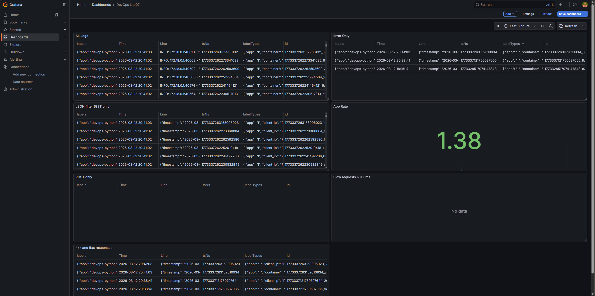
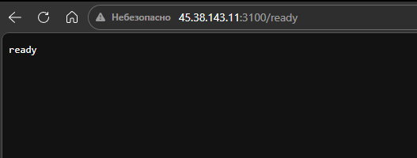
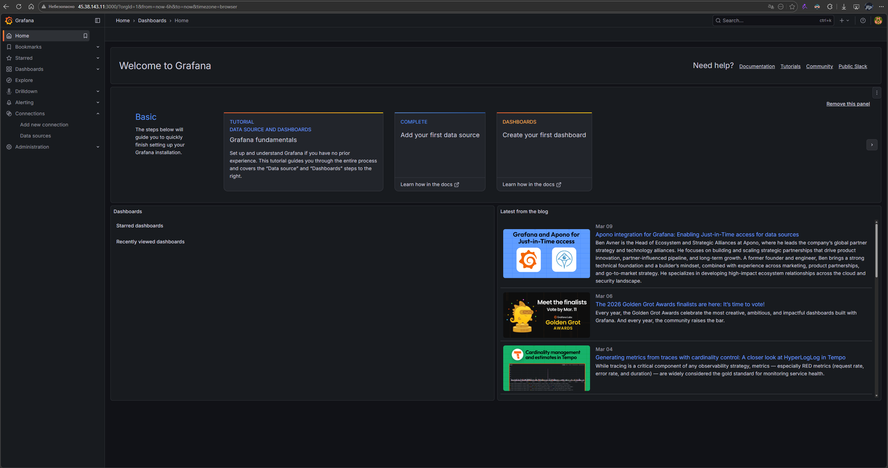

# Lab 7 — Observability & Logging with Loki Stack

**Name:** Timur Salakhov
**Date:** 2026-03-12
**Lab Points:** 10 + 2.5 bonus

---

## 1. Architecture

The logging pipeline follows a simple push model:

```
app-python (stdout JSON logs)
     │
     ▼
Docker Engine  (/var/run/docker.sock + /var/lib/docker/containers)
     │
     ▼
Promtail 3.0  — discovers containers, tails log files, pushes to Loki
     │
     ▼
Loki 3.0      — stores logs in TSDB+filesystem, exposes LogQL query API
     │
     ▼
Grafana 12.3  — queries Loki via datasource, renders dashboards
```

All services run in a shared Docker network (`logging`) defined in `monitoring/docker-compose.yml`.

### Component Summary

| Component | Image | Port | Role |
|-----------|-------|------|------|
| Loki | `grafana/loki:3.0.0` | 3100 | Log storage & query |
| Promtail | `grafana/promtail:3.0.0` | 9080 | Log collection |
| Grafana | `grafana/grafana:12.3.1` | 3000 | Visualisation |
| app-python | `devops-info-service` | 8000→5000 | Application |

---

## 2. Setup Guide

### Prerequisites

- Docker Desktop (Windows) or Docker Engine (Linux) with the Compose v2 plugin
- WSL 2 / Git Bash (on Windows) for shell commands

### Deployment Steps

```bash
# 1. Create secrets file from example
cp monitoring/.env.example monitoring/.env
# Edit monitoring/.env and set a strong GF_SECURITY_ADMIN_PASSWORD

# 2. Build and start the stack
cd monitoring
docker compose up -d --build

# 3. Verify all containers are running
docker compose ps

# 4. Check service health
curl http://localhost:3100/ready      # Loki → "ready"
curl http://localhost:9080/targets    # Promtail targets
curl http://localhost:3000/api/health # Grafana health
```

### Accessing Grafana

Open `http://localhost:3000` and log in with:
- **Username:** `admin`
- **Password:** value of `GF_SECURITY_ADMIN_PASSWORD` from your `.env`

### Adding the Loki Data Source

1. **Connections** → **Data sources** → **Add data source** → **Loki**
2. URL: `http://loki:3100`
3. Click **Save & Test** — should show "Data source connected and labels found"

---

## 3. Configuration

### Loki (`loki/config.yml`)

```yaml
schema_config:
  configs:
    - from: 2020-10-24
      store: tsdb          # TSDB index — up to 10x faster queries than boltdb-shipper
      object_store: filesystem
      schema: v13          # latest schema as of Loki 3.0
      index:
        prefix: index_
        period: 24h
```

**Why TSDB?** Loki 3.0 recommends TSDB over the legacy `boltdb-shipper` — lower memory usage, better compression, and faster query execution for high-cardinality label sets.

**Retention** is enforced by the compactor:

```yaml
limits_config:
  retention_period: 168h  # 7 days

compactor:
  retention_enabled: true
  compaction_interval: 10m
  retention_delete_delay: 2h
```

The `compactor` scans chunks every 10 minutes and schedules deletion of data older than 168 hours after a 2-hour grace period.

### Promtail (`promtail/config.yml`)

```yaml
scrape_configs:
  - job_name: docker
    docker_sd_configs:
      - host: unix:///var/run/docker.sock
        refresh_interval: 5s
        filters:
          - name: label
            values: ["logging=promtail"]   # only containers with this label
    relabel_configs:
      - source_labels: ["__meta_docker_container_name"]
        regex: "/(.*)"
        target_label: container            # strip leading /
      - source_labels: ["__meta_docker_container_label_app"]
        target_label: app                  # promote Docker label → Loki label
```

Promtail uses **Docker service discovery** (`docker_sd_configs`) which connects to the Docker socket to enumerate running containers. Only containers labelled `logging=promtail` are scraped. The `relabel_configs` section promotes Docker metadata into Loki stream labels, enabling per-app queries.

---

## 4. Application Logging

### JSON Logging Implementation

The Python app (`app_python/src/app.py`) uses `python-json-logger` to emit structured JSON to stdout. Each log line is a valid JSON object, making it directly parseable by Loki's `| json` parser.

**Logger setup:**

```python
from pythonjsonlogger import jsonlogger

handler = logging.StreamHandler()
formatter = jsonlogger.JsonFormatter(
    fmt="%(asctime)s %(name)s %(levelname)s %(message)s",
    datefmt="%Y-%m-%dT%H:%M:%S%z",
    rename_fields={"asctime": "timestamp", "levelname": "level"},
)
handler.setFormatter(formatter)
```

**HTTP middleware** (one log line per request):

```python
@app.middleware("http")
async def log_requests(request: Request, call_next):
    start = time.perf_counter()
    response = await call_next(request)
    duration_ms = round((time.perf_counter() - start) * 1000, 2)
    logger.info(
        "http request",
        extra={
            "method": request.method,
            "path": request.url.path,
            "status_code": response.status_code,
            "client_ip": request.client.host,
            "duration_ms": duration_ms,
        },
    )
    return response
```

**Sample log line:**

```json
{"timestamp": "2026-03-12T14:00:01+0000", "name": "app", "level": "INFO",
 "message": "http request", "method": "GET", "path": "/health",
 "status_code": 200, "client_ip": "172.18.0.1", "duration_ms": 1.24}
```

**Why JSON?** Log aggregation tools like Loki can parse structured fields directly, enabling queries such as `| json | status_code >= 400` without regex extraction.

---

## 5. Dashboard

The dashboard contains 4 panels targeting the `devops-.*` app label set.

### Panel 1 — All Application Logs

```logql
{app=~"devops-.*"}
```

Shows a live scrollable table of raw log lines from all application containers. Use the time-range selector to narrow scope.

### Panel 2 — Error Logs

```logql
{app=~"devops-.*"} | json | level="ERROR"
```

Filters to `level=ERROR` after JSON parsing. Useful for quick triage without opening the full log stream.

### Panel 3 — GET logs

```logql
{app="devops-python"} | json | method="GET"
```

Filters to `method=GET` after JSON parsing

### Additional LogQL Queries (Explore)

```logql
# App rate
sum by (app) (rate({app=~"devops-.*"}[1m]))

# Filter by HTTP method
{app="devops-python"} | json | method="POST"

# Slow requests (> 100 ms)
{app="devops-python"} | json | duration_ms > 100

# 4xx and 5xx responses
{app="devops-python"} | json | status_code >= 400
```

**Evidence:**



---

## 6. Production Configuration

### Resource Limits

All services have both a hard `limits` ceiling and a soft `reservations` floor to prevent a single container starving the host:

| Service | CPU limit | Memory limit |
|---------|-----------|--------------|
| Loki | 0.5 | 512 MB |
| Promtail | 0.25 | 256 MB |
| Grafana | 0.5 | 512 MB |
| app-python | 0.5 | 256 MB |

Total worst-case: 1.75 CPU, 1.5 GB RAM — fits within the 1 CPU / 2 GB VPS with room for the OS.

### Security

- **Grafana anonymous access disabled** (`GF_AUTH_ANONYMOUS_ENABLED=false`)
- Admin password stored in `monitoring/.env` (excluded from Git via `.gitignore`)
- Promtail Docker socket mount is **read-only** (`/var/run/docker.sock:ro`)
- Container log directory is **read-only** (`/var/lib/docker/containers:ro`)

### Health Checks

```yaml
# Loki
healthcheck:
  test: ["CMD-SHELL", "wget --no-verbose --tries=1 --spider http://localhost:3100/ready || exit 1"]
  interval: 10s
  timeout: 5s
  retries: 5
  start_period: 20s

# Grafana
healthcheck:
  test: ["CMD-SHELL", "wget --no-verbose --tries=1 --spider http://localhost:3000/api/health || exit 1"]
  interval: 10s
  timeout: 5s
  retries: 5
  start_period: 20s
```

`start_period` gives Loki 20 s to initialise TSDB before health checks begin, preventing false restarts on a slow host.

### Log Retention

7-day retention via Loki compactor. Old chunks are marked for deletion every 10 minutes with a 2-hour grace period, ensuring no abrupt data loss.

---

## 7. Testing

### Verify stack is running

```bash
cd monitoring
docker compose ps
# All services should show "healthy"
```

### Verify Loki

```bash
curl http://localhost:3100/ready
# Expected: "ready"

curl http://localhost:3100/loki/api/v1/labels
# Expected: JSON with label names
```

### Verify Promtail targets

```bash
curl http://localhost:9080/targets
# Expected: JSON listing discovered containers
```

### Generate log traffic

```bash
# Bash / WSL / Git Bash
for i in $(seq 1 20); do curl -s http://localhost:8000/ > /dev/null; done
for i in $(seq 1 20); do curl -s http://localhost:8000/health > /dev/null; done
# Trigger a 404 to test error logging
curl -s http://localhost:8000/nonexistent > /dev/null
```

### Verify logs in Grafana Explore

Open `http://localhost:3000/explore` and run:

```logql
{app=~".+"}
```

You should see logs from at least 3 containers (loki, grafana, app-python).

### Test LogQL parsing

```logql
# Confirm JSON parsing works
{app="devops-python"} | json

# Confirm field extraction
{app="devops-python"} | json | method="GET"

# Confirm error filtering
{app="devops-python"} | json | level="ERROR"
```

---

## 8. Ansible Bonus — Automated Deployment

The `ansible/roles/monitoring` role automates the full Loki stack deployment to the VPS.

### Role Structure

```
ansible/roles/monitoring/
├── defaults/main.yml        # Versions, ports, paths, resource limits
├── handlers/main.yml        # Restart monitoring stack on config change
├── meta/main.yml            # Depends on: docker role
└── tasks/
    ├── main.yml             # Orchestration (setup → deploy)
    ├── setup.yml            # Create dirs, template configs
    └── deploy.yml           # docker_compose_v2, health wait, Grafana datasource
templates/
    ├── docker-compose.yml.j2
    ├── loki-config.yml.j2
    └── promtail-config.yml.j2
```

### Running the Playbook

```bash
cd ansible

# First run (installs + configures)
ansible-playbook playbooks/deploy-monitoring.yml -i inventory/hosts.ini --vault-password-file ~/.vault_pass_lab05

# Idempotency test (second run — should show 0 changed)
ansible-playbook playbooks/deploy-monitoring.yml -i inventory/hosts.ini --vault-password-file ~/.vault_pass_lab05
```

### Playbook Output (first run)

```shell
claymix@claymix:/mnt/c/Users/claym/Desktop/study/Spring25/DevOps/DevOps-Core-Course/ansible$ ansible-playbook playbooks/deploy-monitoring.yml -i inventory/hosts.ini --vault-password-
file ~/.vault_pass_lab05
[WARNING]: Ansible is being run in a world writable directory (/mnt/c/Users/claym/Desktop/study/Spring25/DevOps/DevOps-Core-Course/ansible), ignoring it as an ansible.cfg source.
For more information see https://docs.ansible.com/ansible/devel/reference_appendices/config.html#cfg-in-world-writable-dir
[WARNING]: Collection community.docker does not support Ansible version 2.16.3

PLAY [Deploy Loki monitoring stack] **************************************************************************************************************************************************

TASK [Gathering Facts] ***************************************************************************************************************************************************************
ok: [dvrg]

TASK [docker : Install Docker prerequisites] *****************************************************************************************************************************************
ok: [dvrg]

TASK [docker : Create Docker GPG keyring directory] **********************************************************************************************************************************
ok: [dvrg]

TASK [docker : Download Docker GPG key] **********************************************************************************************************************************************
ok: [dvrg]

TASK [docker : Add Docker apt repository] ********************************************************************************************************************************************
ok: [dvrg]

TASK [docker : Install Docker packages] **********************************************************************************************************************************************
ok: [dvrg]

TASK [docker : Ensure Docker service is started and enabled] *************************************************************************************************************************
ok: [dvrg]

TASK [docker : Add user to docker group] *********************************************************************************************************************************************
ok: [dvrg]

TASK [docker : Install python3-docker for Ansible Docker modules] ********************************************************************************************************************
ok: [dvrg]

TASK [../roles/monitoring : Create monitoring directory structure] *******************************************************************************************************************
changed: [dvrg] => (item=/opt/monitoring)
changed: [dvrg] => (item=/opt/monitoring/loki)
changed: [dvrg] => (item=/opt/monitoring/promtail)
changed: [dvrg] => (item=/opt/monitoring/docs)

TASK [../roles/monitoring : Template Loki configuration] *****************************************************************************************************************************
changed: [dvrg]

TASK [../roles/monitoring : Template Promtail configuration] *************************************************************************************************************************
changed: [dvrg]

TASK [../roles/monitoring : Template Docker Compose file] ****************************************************************************************************************************
changed: [dvrg]

TASK [../roles/monitoring : Start monitoring stack with Docker Compose v2] ***********************************************************************************************************
changed: [dvrg]

TASK [../roles/monitoring : Wait for Loki to be ready] *******************************************************************************************************************************
ok: [dvrg]

TASK [../roles/monitoring : Wait for Grafana to be ready] ****************************************************************************************************************************
FAILED - RETRYING: [dvrg]: Wait for Grafana to be ready (12 retries left).
ok: [dvrg]

TASK [../roles/monitoring : Configure Loki data source in Grafana] *******************************************************************************************************************
changed: [dvrg]

RUNNING HANDLER [../roles/monitoring : Restart monitoring stack] *********************************************************************************************************************
changed: [dvrg]

PLAY RECAP ***************************************************************************************************************************************************************************
dvrg                       : ok=18   changed=7    unreachable=0    failed=0    skipped=0    rescued=0    ignored=0
```

### Playbook Output (second run — idempotency)

```shell
claymix@claymix:/mnt/c/Users/claym/Desktop/study/Spring25/DevOps/DevOps-Core-Course/ansible$ ansible-playbook playbooks/deploy-monitoring.yml -i inventory/hosts.ini --vault-password-file ~/.vault_pass_lab05
[WARNING]: Ansible is being run in a world writable directory (/mnt/c/Users/claym/Desktop/study/Spring25/DevOps/DevOps-Core-Course/ansible), ignoring it as an ansible.cfg source.
For more information see https://docs.ansible.com/ansible/devel/reference_appendices/config.html#cfg-in-world-writable-dir
[WARNING]: Collection community.docker does not support Ansible version 2.16.3

PLAY [Deploy Loki monitoring stack] **************************************************************************************************************************************************

TASK [Gathering Facts] ***************************************************************************************************************************************************************
ok: [dvrg]

TASK [docker : Install Docker prerequisites] *****************************************************************************************************************************************
ok: [dvrg]

TASK [docker : Create Docker GPG keyring directory] **********************************************************************************************************************************
ok: [dvrg]

TASK [docker : Download Docker GPG key] **********************************************************************************************************************************************
ok: [dvrg]

TASK [docker : Add Docker apt repository] ********************************************************************************************************************************************
ok: [dvrg]

TASK [docker : Install Docker packages] **********************************************************************************************************************************************
ok: [dvrg]

TASK [docker : Ensure Docker service is started and enabled] *************************************************************************************************************************
ok: [dvrg]

TASK [docker : Add user to docker group] *********************************************************************************************************************************************
ok: [dvrg]

TASK [docker : Install python3-docker for Ansible Docker modules] ********************************************************************************************************************
ok: [dvrg]

TASK [../roles/monitoring : Create monitoring directory structure] *******************************************************************************************************************
ok: [dvrg] => (item=/opt/monitoring)
ok: [dvrg] => (item=/opt/monitoring/loki)
ok: [dvrg] => (item=/opt/monitoring/promtail)
ok: [dvrg] => (item=/opt/monitoring/docs)

TASK [../roles/monitoring : Template Loki configuration] *****************************************************************************************************************************
ok: [dvrg]

TASK [../roles/monitoring : Template Promtail configuration] *************************************************************************************************************************
ok: [dvrg]

TASK [../roles/monitoring : Template Docker Compose file] ****************************************************************************************************************************
ok: [dvrg]

TASK [../roles/monitoring : Start monitoring stack with Docker Compose v2] ***********************************************************************************************************
ok: [dvrg]

TASK [../roles/monitoring : Wait for Loki to be ready] *******************************************************************************************************************************
ok: [dvrg]

TASK [../roles/monitoring : Wait for Grafana to be ready] ****************************************************************************************************************************
ok: [dvrg]

TASK [../roles/monitoring : Configure Loki data source in Grafana] *******************************************************************************************************************
ok: [dvrg]

PLAY RECAP ***************************************************************************************************************************************************************************
dvrg                       : ok=17   changed=0    unreachable=0    failed=0    skipped=0    rescued=0    ignored=0
```

### Verification on VPS

```bash
curl http://45.38.143.11:3100/ready
# open http://45.38.143.11:3000 in browser
```

**Evidence:**



---

## 9. Challenges


| Challenge | Solution |
|-----------|----------|
| Promtail not discovering containers | Ensured Docker socket is mounted read-only; confirmed `logging=promtail` label is set on app container |
| Loki startup slow on 1-CPU VPS | Added `start_period: 20s` to health check to give TSDB time to initialise |
| JSON parsing fails in LogQL | Verified app emits valid single-line JSON by running `docker logs app-python \| python -m json.tool` |
