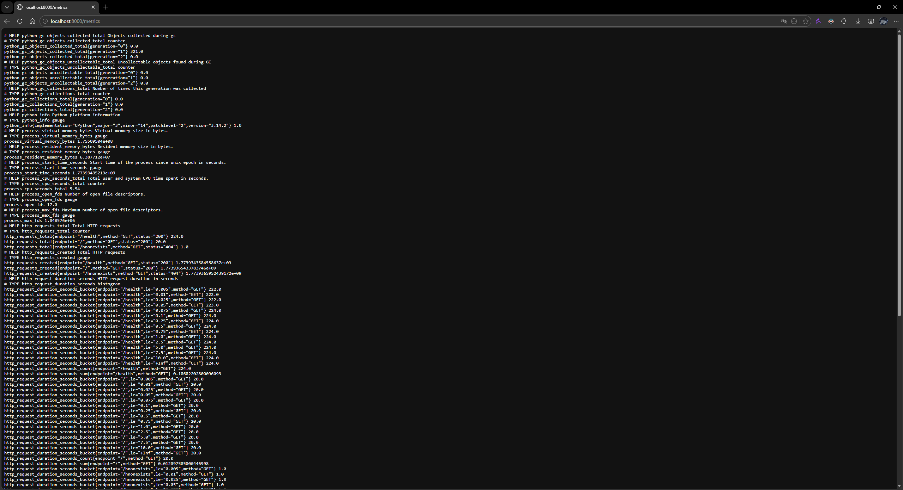
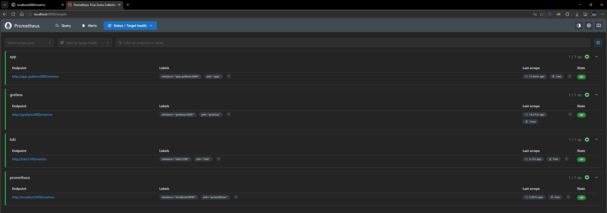
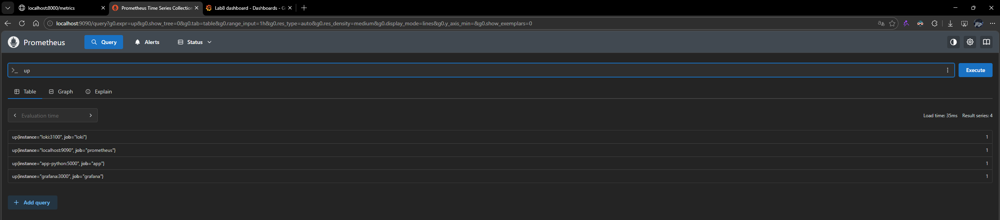
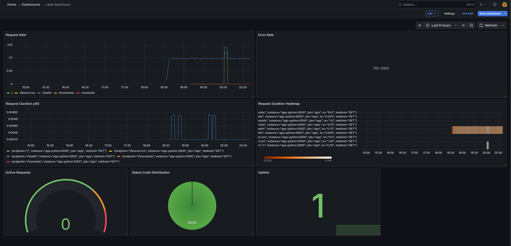
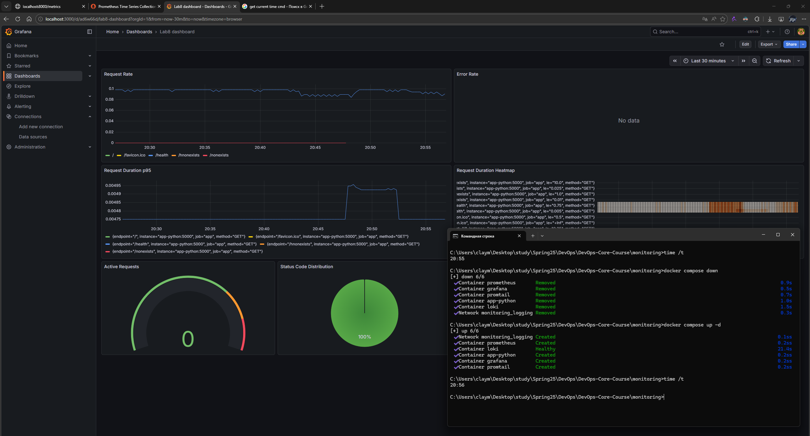

# Lab 8 — Metrics & Monitoring with Prometheus

**Name:** Timur Salakhov

**Date:** 2026-03-19

**Lab Points:** 10

---

## 1. Architecture

The metrics pipeline follows a pull-based model — Prometheus scrapes `/metrics`
endpoints exposed by each service and stores the time-series data in its local
TSDB. Grafana queries Prometheus (and Loki from Lab 7) to render dashboards.

```
app-python (:5000/metrics)  ──┐
                               ├──▶  Prometheus (:9090)  ──▶  Grafana (:3000)
Loki       (:3100/metrics)  ──┤          │
Grafana    (:3000/metrics)  ──┘          │
                                    self-scrape
```

All services run in the shared `logging` Docker network defined in
`monitoring/docker-compose.yml`.

### Component Summary

| Component  | Image                        | Port        | Role                    |
|------------|------------------------------|-------------|-------------------------|
| Prometheus | `prom/prometheus:v3.9.0`     | 9090        | Metric scraping & TSDB  |
| Loki       | `grafana/loki:3.0.0`         | 3100        | Log storage & query     |
| Promtail   | `grafana/promtail:3.0.0`     | 9080        | Log collection          |
| Grafana    | `grafana/grafana:12.3.1`     | 3000        | Visualisation           |
| app-python | `devops-info-service:local`  | 8000→5000   | Application             |

---

## 2. Application Instrumentation

### Why Metrics?

| Pillar  | Tool     | Question answered           |
|---------|----------|-----------------------------|
| Logs    | Loki     | *What happened?*            |
| Metrics | Prometheus | *How much / how often?*   |

Together they provide complete observability.

### The RED Method

The application is instrumented following the **RED method** for
request-driven services:

- **R**ate — `http_requests_total` (Counter, labels: `method`, `endpoint`, `status`)
- **E**rrors — same counter filtered to `status=~"5.."`
- **D**uration — `http_request_duration_seconds` (Histogram, labels: `method`, `endpoint`)

### Additional Metrics

| Metric | Type | Purpose |
|--------|------|---------|
| `http_requests_in_progress` | Gauge | Current concurrent request count |
| `devops_info_endpoint_calls` | Counter (label: `endpoint`) | Business-level call tracking per endpoint |
| `devops_info_system_collection_seconds` | Histogram | Time to gather system information on `/` |

### Implementation Details

- Library: `prometheus-client==0.23.1`
- Metrics are recorded inside a single ASGI middleware that wraps every
  request (except `/metrics` itself to avoid recursion).
- The `/metrics` endpoint returns `generate_latest()` in Prometheus
  exposition format.

---

## 3. Prometheus Configuration

**File:** `monitoring/prometheus/prometheus.yml`

```yaml
global:
  scrape_interval: 15s
  evaluation_interval: 15s

scrape_configs:
  - job_name: "prometheus"     # self-scrape
    static_configs:
      - targets: ["localhost:9090"]

  - job_name: "app"            # Python application
    static_configs:
      - targets: ["app-python:5000"]
    metrics_path: "/metrics"

  - job_name: "loki"           # Loki log storage
    static_configs:
      - targets: ["loki:3100"]
    metrics_path: "/metrics"

  - job_name: "grafana"        # Grafana UI
    static_configs:
      - targets: ["grafana:3000"]
    metrics_path: "/metrics"
```

Targets use Docker Compose service names as hostnames with internal
container ports (e.g., `app-python:5000`, not the host-mapped `8000`).

### Retention Policy

| Setting | Value | Configured via |
|---------|-------|----------------|
| Time-based retention | 15 days | `--storage.tsdb.retention.time=15d` |
| Size-based retention | 10 GB | `--storage.tsdb.retention.size=10GB` |

Both are passed as command-line arguments to the Prometheus container.
Whichever limit is hit first triggers data deletion.

---

## 4. Dashboard Walkthrough

The application dashboard is auto-provisioned via
`monitoring/grafana/provisioning/dashboards/app-dashboard.json` and contains
7 panels:

| # | Panel | Type | PromQL Query | Purpose |
|---|-------|------|-------------|---------|
| 1 | Request Rate | Timeseries | `sum(rate(http_requests_total[5m])) by (endpoint)` | Requests/sec per endpoint |
| 2 | Error Rate | Timeseries | `sum(rate(http_requests_total{status=~"5.."}[5m]))` | 5xx errors/sec |
| 3 | Request Duration p95 | Timeseries | `histogram_quantile(0.95, rate(http_request_duration_seconds_bucket[5m]))` | 95th-percentile latency |
| 4 | Request Duration Heatmap | Heatmap | `rate(http_request_duration_seconds_bucket[5m])` | Latency distribution |
| 5 | Active Requests | Gauge | `http_requests_in_progress` | Concurrent in-flight requests |
| 6 | Status Code Distribution | Pie chart | `sum by (status) (rate(http_requests_total[5m]))` | 2xx / 4xx / 5xx breakdown |
| 7 | App Uptime | Stat | `up{job="app"}` | Is the target alive? |

Data sources (Prometheus + Loki) are also provisioned automatically via
`monitoring/grafana/provisioning/datasources/datasources.yml`.

---

## 5. PromQL Examples

### 1. Total request rate across all endpoints

```promql
sum(rate(http_requests_total[5m]))
```

Returns the overall requests-per-second across all methods, endpoints, and
status codes.

### 2. Error rate (5xx only)

```promql
sum(rate(http_requests_total{status=~"5.."}[5m]))
```

Filters to server errors and computes the per-second rate over a 5-minute
window.

### 3. 95th-percentile latency

```promql
histogram_quantile(0.95, rate(http_request_duration_seconds_bucket[5m]))
```

Uses the histogram buckets to approximate the latency that 95 % of requests
fall below.

### 4. Request rate per endpoint

```promql
sum by (endpoint) (rate(http_requests_total[5m]))
```

Groups by the `endpoint` label to compare traffic across routes.

### 5. Services that are down

```promql
up == 0
```

Returns any scrape target whose last scrape failed (value = 0).

### 6. Prometheus CPU usage

```promql
rate(process_cpu_seconds_total{job="prometheus"}[5m]) * 100
```

Returns the percentage of CPU time consumed by the Prometheus process.

### Metrics vs Logs — When to use each

| Use case | Tool | Why |
|----------|------|-----|
| Request rate trending | Prometheus | Numeric aggregation over time |
| Error investigation | Loki | Need full log context, stack traces |
| Alerting on latency | Prometheus | Quantile thresholds are natural PromQL |
| Audit trail | Loki | Structured log records per event |
| Capacity planning | Prometheus | Resource gauges & growth rates |

---

## 6. Production Setup

### Health Checks

Every service in `docker-compose.yml` has a health check:

| Service | Health endpoint | Interval |
|---------|----------------|----------|
| Loki | `GET /ready` | 10 s |
| Promtail | `GET /ready` | 10 s |
| Grafana | `GET /api/health` | 10 s |
| Prometheus | `GET /-/healthy` | 10 s |
| app-python | `GET /health` (via Python urllib) | 10 s |

### Resource Limits

| Service | Memory | CPU |
|---------|--------|-----|
| Prometheus | 1 G | 1.0 |
| Loki | 1 G | 1.0 |
| Grafana | 512 M | 0.5 |
| Promtail | 256 M | 0.25 |
| app-python | 256 M | 0.5 |

### Persistent Volumes

| Volume | Mount point | Purpose |
|--------|-------------|---------|
| `prometheus-data` | `/prometheus` | TSDB storage |
| `loki-data` | `/loki` | Log chunks & indices |
| `grafana-data` | `/var/lib/grafana` | Dashboards, sessions |

Data survives `docker compose down` / `docker compose up -d` cycles.

### Retention Policies

| System | Retention | Configuration |
|--------|-----------|---------------|
| Prometheus | 15 days / 10 GB | CLI flags `--storage.tsdb.retention.*` |
| Loki | 7 days (168 h) | `limits_config.retention_period` in `loki/config.yml` |

---

## 7. Testing Results

### Deploy & Verify

```bash
cd monitoring
docker compose up -d --build
docker compose ps          # all services healthy
```

### Metrics Endpoint

```bash
curl http://localhost:8000/metrics
```



### Prometheus Targets

Open http://localhost:9090/targets — all four jobs (prometheus, app, loki,
grafana) should show **UP**.



### PromQL Query

Run `up` in the Prometheus expression browser.



### Grafana Dashboard

Open http://localhost:3000 → **Dashboards** → **Application Metrics**.
All 7 panels should display live data after generating some traffic:

```bash
for i in $(seq 1 20); do curl -s http://localhost:8000/ > /dev/null; done
curl http://localhost:8000/health
curl http://localhost:8000/nonexistent
```



### Persistence Test

```bash
docker compose down
docker compose up -d
# Open Grafana — dashboard and data source should still be present
```



---

## 8. Challenges & Solutions

| Challenge | Solution |
|-----------|----------|
| Prometheus target shows `app-python:8000` as DOWN | Inside the Docker network the container port is **5000**, not the host-mapped 8000. Changed target to `app-python:5000`. |
| `/metrics` requests inflating counters | Excluded `/metrics` path from the tracking middleware to keep metric cardinality clean. |
| Grafana data source not available on first boot | Used Grafana provisioning (`/etc/grafana/provisioning/datasources/`) to auto-register both Prometheus and Loki data sources. |
| Dashboard lost after `docker compose down` | Ensured the dashboard is file-provisioned (not just saved in Grafana DB) and `grafana-data` volume persists. |
